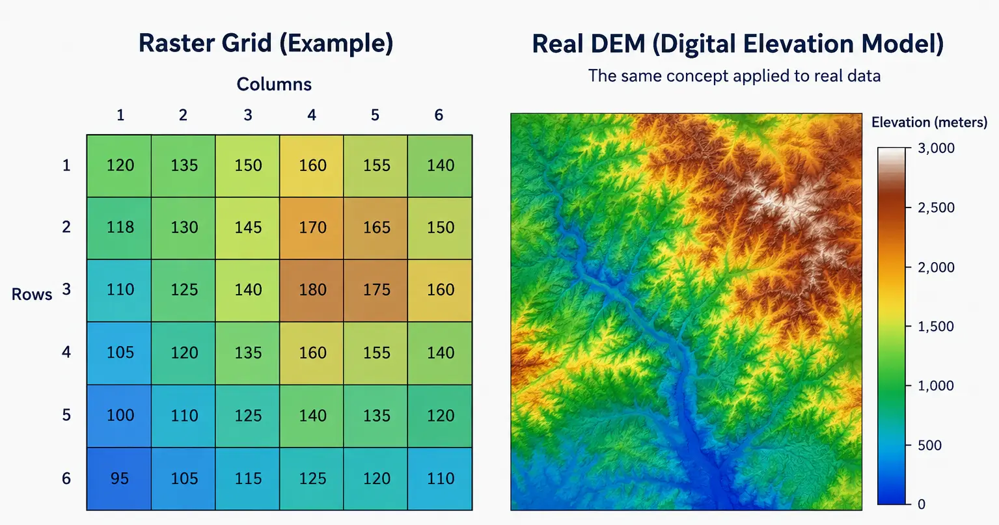

## Introduction

::: {style="text-align: justify;"}
Every spatial dataset you will encounter falls into one of two fundamental models: raster or vector. This session focuses entirely on the first. Raster data represents the world as a continuous grid of equally sized cells, called pixels, laid out in rows and columns. Each pixel holds one value, and that value can represent almost anything measured across space: elevation above sea level, reflected sunlight captured by a satellite sensor, air temperature, population density, or the probability that a given location is suitable for a solar installation. What makes a raster a raster is not what it measures, but how it is structured: a regular grid, sampled at a fixed interval known as the spatial resolution.
:::

::: {style="margin-top: 30px; margin-bottom: 45px; text-align: center;"}
{fig-alt="a simple diagram showing a raster grid with rows and columns, each cell labeled with a pixel value, next to a real DEM or satellite image to show the same concept applied to real data" width="100%"}
:::

::: {style="text-align: center; margin-top: -25px; margin-bottom: 50px; font-size: 0.85em; opacity: 0.65;"}
*Image generated with GPT Image 2.5.*
:::

::: {style="text-align: justify;"}
Spatial resolution is the single most important property of a raster to internalize early. A resolution of 30 meters means each pixel represents a 30 by 30 meter square on the ground; anything smaller than that square, any variation happening inside it, is invisible to the dataset and gets averaged or generalized into a single value. Choosing a resolution is always a trade-off between detail and file size: a 10 meter Sentinel-2 image of a whole province is already close to a gigabyte, while the same area at 30 meters would be a fraction of that size but far less able to distinguish small features, such as a narrow road or an individual building.
:::

::: {style="text-align: justify;"}
A raster is never just a grid of numbers. Every raster file also carries geographic metadata that ties that grid to a real location on Earth: a coordinate reference system (CRS), defining which projection and datum the coordinates use, and an affine transform, defining exactly how a pixel's row and column position maps to a real-world coordinate. Without this metadata, a raster is just an image; with it, a raster becomes a georeferenced dataset that can be measured, compared, and combined with other spatial data. This is the deepest conceptual difference between a raster and an ordinary photograph: a photograph has pixels, but a raster has pixels that know exactly where they are. We will look closely at this metadata in [**Session 03**](session-03-raster-metadata-crs.qmd); for now it is enough to know that it exists.
:::

::: {style="text-align: justify;"}
Rasters also differ in how many bands they carry. A DEM typically holds a single band, since elevation is a single measurement per location. A satellite image such as Sentinel-2 holds several bands stacked together, one per spectral wavelength range the sensor captures, such as red, green, blue, and near infrared. Each band is itself a full 2D grid at the same resolution and extent, so a multi-band raster can be thought of as a stack of aligned grids rather than a single one.
:::

## The Solar Suitability Project

::: {style="text-align: justify;"}
Over the next ten sessions, we build a single project from start to finish: an application that identifies the most suitable locations for solar panel installation around the Desierto de Tabernas in Almeria. Each session adds one concrete piece, and by the final session everything is combined into an interactive web application. The analysis rests on four factors: slope and aspect, both derived from a Digital Elevation Model, land cover derived from a Sentinel-2 image, and accessibility to roads and power lines. Every raster and vector operation we learn in this course exists to eventually feed into that final suitability map.
:::

::: {style="text-align: justify;"}
This session is the starting point: getting our tools installed, understanding what raster data is, and taking our first real look at the data we will spend the rest of the course working with.
:::

## Setting Up the Project

::: {style="text-align: justify;"}
Our project keeps raw data in a `data/` folder, generated outputs in `data/outputs/`, and the processing logic for each session in its own file inside a `modules/` folder. This session begins that structure with `data_loader.py`, the first module we build.
:::

```
solar_suitability_project/
├── data/
│   ├── dem.tif
│   ├── sentinel.tif
│   ├── Desierto_de_Tabernas.gpkg
│   ├── road.gpkg
│   ├── power.gpkg
│   └── outputs/
├── modules/
│   └── data_loader.py
└── main.py
```

::: {style="text-align: justify;"}
Every library used in this course can be installed with `pip`. For this session, we only need three of them.
:::

```
pip install rasterio geopandas matplotlib
```

::: {.callout-note style="text-align: justify;"}
`dem.tif` and `sentinel.tif` are raster files. `Desierto_de_Tabernas.gpkg` is a vector boundary in the GeoPackage format, a single-file, SQLite-based container for vector layers. We use it only briefly in this session, to draw it over the raster. `road.gpkg` and `power.gpkg` are not used until [**session 02**](session-02-vector-data.qmd).
:::

## Import Libraries

::: {style="text-align: justify;"}
`rasterio` is the core library for reading and writing raster data, built on top of GDAL, the standard low-level engine for geospatial data access. `matplotlib` is used for all visualization. We import both up front.
:::

```{python}
import rasterio
import matplotlib.pyplot as plt
```

## Reading and Displaying a Raster

::: {style="text-align: justify;"}
A raster file is opened with `rasterio.open()`, which returns a dataset object giving access to both the pixel values and the geographic metadata attached to the file. Before introducing the pattern we will use throughout this course, it is worth seeing the plain, manual way of doing this first.
:::

```{python}
sentinel_path = "data/sentinel.tif"

# Without with: we must open and close the file ourselves
src = rasterio.open(sentinel_path)
print("Number of bands:", src.count)
print("Width, height:", src.width, src.height)
src.close()
```

::: {.callout-warning style="text-align: justify;"}
In this approach, if we forget to call `src.close()`, or an error occurs between opening and closing the file, the file stays open and system resources are never released. This is why the standard, recommended pattern throughout this course is the `with` block, shown next: the file closes automatically, even if an error occurs inside the block. This is the same pattern used when reading plain text files in Python, and you should use it every time you open a raster in this course.
:::

```{python}
with rasterio.open(sentinel_path) as src:
    print("Number of bands:", src.count)
    print("Width, height:", src.width, src.height)
```

::: {.callout-important style="text-align: justify;"}
Anything you read inside the `with` block, such as pixel values, should be stored in a variable if you need it afterward. The dataset object itself, `src`, becomes unusable once the block ends and the file is closed.
:::

::: {style="text-align: justify;"}
`rasterio.plot.show` is a convenience function built specifically to display raster data correctly, plotting pixels at their true geographic coordinates using the file's transform, rather than raw pixel indices. Passed a multi-band dataset directly, it automatically builds a simple color composite from the first three bands.
:::

```{python}
from rasterio.plot import show

with rasterio.open(sentinel_path) as src:
    fig, ax = plt.subplots(figsize=(8, 8))
    show(src, ax=ax)
    ax.set_title("Sentinel-2 Image, Desierto de Tabernas")
    plt.show()
```

::: {.callout-note style="text-align: justify;"}
The colors in this first look are not necessarily a fully accurate natural color image, since we have not yet told `rasterio` which bands correspond to red, green, and blue, or corrected the brightness. For now, this is enough to confirm the file opens correctly and to see the shape of our study area. The next plot explains exactly why it looks the way it does.
:::

```{python}
import numpy as np

with rasterio.open(sentinel_path) as src:
    fig, ax = plt.subplots(figsize=(8, 8))
    # Bands reordered to Red, Green, Blue (3, 2, 1) for true color
    rgb = src.read([3, 2, 1]).astype("float32")
    # Normalize each band to the 0-1 range using percentile stretch
    for i in range(rgb.shape[0]):
        band = rgb[i]
        low, high = np.percentile(band, (2, 98))
        rgb[i] = np.clip((band - low) / (high - low), 0, 1)
    show(rgb, transform=src.transform, ax=ax)
    ax.set_title("Sentinel-2 Image (True Color, bands 3-2-1)")
    plt.show()
```

::: {.callout-note style="text-align: justify;"}
The image above the plot appears blue because `show(src)` by default maps a dataset's first, second, and third bands to the red, green, and blue display channels, in that order. In this course's `sentinel.tif`, band 1 is Blue, band 2 is Green, and band 3 is Red, so that default mapping swaps the colors and tints the whole image blue. Passing the bands manually in true-color order, `[3, 2, 1]` (Red, Green, Blue), displays the image with realistic colors instead. We look at band order and building a proper color composite in more detail in [**Session 03**](session-03-raster-metadata-crs.qmd); this is just a quick preview of why the problem happens.
:::

## Overlaying the Study Boundary

::: {style="text-align: justify;"}
We use `geopandas` to read the vector boundary of our study area. `geopandas` extends the familiar `pandas` DataFrame with a geometry column, allowing spatial data to be read and drawn with a simple, consistent syntax. We will study it properly in the next session; here we only need `.read_file()` and `.plot()`.
:::

```{python}
import geopandas as gpd

boundary = gpd.read_file("data/Desierto_de_Tabernas.gpkg")
boundary.head()
```

::: {style="text-align: justify;"}
Before drawing two spatial datasets together, we must confirm they share the same coordinate reference system. If they do not, the two layers are measured in different units or origins, and drawing them on the same axes places them in completely different, unrelated positions, which is exactly what causes the boundary to appear missing or wildly out of place. We cover CRS properly in [**Session 03**](session-03-raster-metadata-crs.qmd); for now we only need `.to_crs()` to fix a mismatch when we find one.
:::

```{python}
with rasterio.open(sentinel_path) as src:
    sentinel_crs = src.crs

print("Sentinel CRS:", sentinel_crs)
print("Boundary CRS:", boundary.crs)
print("Match:", sentinel_crs == boundary.crs)

if boundary.crs != sentinel_crs:
    boundary = boundary.to_crs(sentinel_crs)
```

```{python}
with rasterio.open(sentinel_path) as src:
    fig, ax = plt.subplots(figsize=(8, 8))
    show(src, ax=ax)
    boundary.boundary.plot(ax=ax, edgecolor="red", linewidth=1.5)
    ax.set_title("Sentinel-2 Image with Study Area Boundary")
    plt.show()
```

::: {.callout-important style="text-align: justify;"}
`boundary.to_crs(sentinel_crs)` reprojects the boundary's coordinates to match the raster, without changing the raster itself. Always reproject the vector layer to match the raster's CRS, rather than the other way around, since reprojecting a raster is a more expensive resampling operation, while reprojecting a vector layer is a straightforward coordinate transformation.
:::

<details>
<summary>Exercise: Open the DEM</summary>

::: {style="text-align: justify;"}
Open `data/dem.tif` the same way we opened the Sentinel image, and display it with `rasterio.plot.show` using the colormap `"terrain"`. Then draw the study area boundary on top of it, exactly as we did above.
:::

<details>
<summary>Solution</summary>

```{python}
dem_path = "data/dem.tif"

with rasterio.open(dem_path) as src:
    dem_crs = src.crs

boundary_for_dem = boundary.to_crs(dem_crs) if boundary.crs != dem_crs else boundary

with rasterio.open(dem_path) as src:
    fig, ax = plt.subplots(figsize=(8, 8))
    show(src, ax=ax, cmap="terrain")
    boundary_for_dem.boundary.plot(ax=ax, edgecolor="red", linewidth=1.5)
    ax.set_title("DEM with Study Area Boundary")
    plt.show()
```

</details>
</details>

## Building `data_loader.py`

::: {style="text-align: justify;"}
Every session in this course ends by adding to the project's `modules/` folder. This session, we wrap the two loading steps above into small, reusable functions, saved into `modules/data_loader.py`. Later sessions will simply import from this file instead of repeating these steps.
:::

```python
# modules/data_loader.py

import rasterio
import geopandas as gpd


def load_raster(path):
    """Open a raster file and return the dataset path for later use with rasterio.open()."""
    with rasterio.open(path) as src:
        print(f"Loaded raster: {path} ({src.width}x{src.height}, {src.count} band(s))")
    return path


def load_boundary(path):
    """Load a vector boundary file as a GeoDataFrame."""
    boundary = gpd.read_file(path)
    print(f"Loaded boundary: {path} ({len(boundary)} feature(s))")
    return boundary
```

::: {.callout-tip style="text-align: justify;"}
Notice that `load_raster` does not return the pixel values themselves, only the confirmed file path. This mirrors how we will keep using `rasterio` throughout the course: opening a raster is cheap, but its data should only be read inside a `with` block, at the moment it is actually needed.
:::

## Summary

::: {style="text-align: justify;"}
This session introduced the raster data model, set up our project structure and libraries, and took our first real look at the Sentinel-2 image and DEM we will use throughout the course, overlaying our study area boundary on top of the Sentinel image. We also started `modules/data_loader.py`, the first building block of our solar suitability project. [**Session 02**](session-02-vector-data.qmd) introduces vector data properly, working with the road and power line layers we have not yet touched.
:::