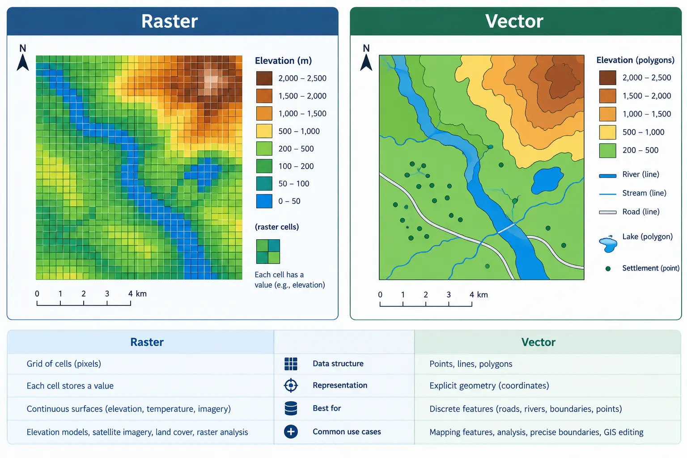
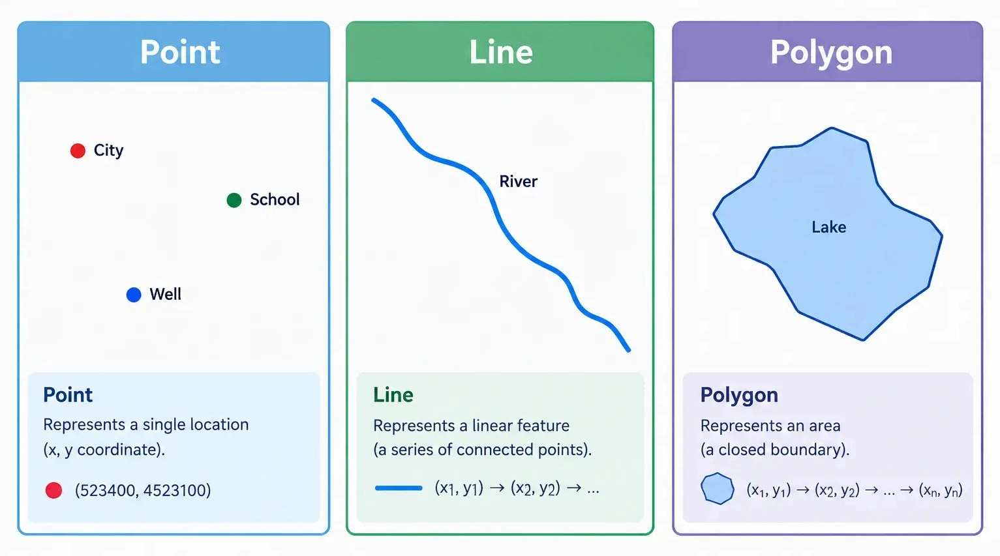

## Introduction

::: {style="text-align: justify;"}
In [**Session 01**](session-01-intro-loading-data.qmd) we worked entirely with raster data: continuous grids of pixels representing elevation and reflectance across our study area. Vector data takes a fundamentally different approach to representing the world. Instead of a regular grid of equally sized cells, vector data describes discrete, individual features using precise geometric shapes, and attaches attribute information directly to each one. A road is not smeared across a grid the way elevation is; it is a single, precisely traced line with a name, a surface type, and a length. This distinction, discrete geometry with attributes versus a continuous sampled grid, is the deepest conceptual divide in all of spatial data, and almost every tool and workflow in GIS sits on one side of it or the other.
:::

::: {style="margin-top: 30px; margin-bottom: 45px; text-align: center;"}
{fig-alt="side-by-side comparison of the same area shown as a raster grid versus as vector features (points, lines, polygons), to visually reinforce the raster vs vector distinction" width="100%"}
:::

::: {style="text-align: center; margin-top: -25px; margin-bottom: 50px; font-size: 0.85em; opacity: 0.65;"}
*Image generated with GPT Image 2.5.*
:::

::: {style="text-align: justify;"}
Vector data is built from three basic geometry types, and their multi-part counterparts.
:::

### Points

::: {style="text-align: justify;"}
A point represents a single location in space, defined by a single coordinate pair. Points are used for features that are best represented as a location without meaningful area or length: a single power pole, a transformer, a weather station. In our course data, `power.gpkg` stores exactly this kind of feature, as we will see shortly.
:::

### Lines (LineStrings)

::: {style="text-align: justify;"}
A line, formally called a LineString, represents a feature with length but no area: a sequence of connected coordinate pairs forming a path. Roads and power lines are the classic examples. A LineString has a length, a start point, and an end point, but does not enclose any space. `road.gpkg` and part of `power.gpkg` are built from this kind of geometry.
:::

### Polygons

::: {style="text-align: justify;"}
A polygon represents a feature with an enclosed area: a boundary, a building footprint, a lake, or an administrative region. A polygon is defined by an outer ring of coordinates that closes back on itself, and optionally one or more inner rings representing holes cut out of that area. `Desierto_de_Tabernas.gpkg`, our study area boundary, is a polygon.
:::

::: {style="margin-top: 30px; margin-bottom: 45px; text-align: center;"}
{fig-alt="a simple diagram showing a point, a line, and a polygon side by side, each labeled, to illustrate the three basic vector geometry types" width="100%"}
:::

::: {style="text-align: center; margin-top: -25px; margin-bottom: 50px; font-size: 0.85em; opacity: 0.65;"}
*Image generated with GPT Image 2.5.*
:::

### Multi-part Geometries

::: {style="text-align: justify;"}
Any of the three basic types can also exist in a multi-part form: MultiPoint, MultiLineString, and MultiPolygon. A single feature in the real world is sometimes naturally split into multiple disconnected pieces that still belong to one logical entity. `road.gpkg`, for example, stores every road segment as a MultiLineString rather than a plain LineString, since a single named road in OpenStreetMap is often broken into several disconnected parts. We will see this directly when we open the file later in this session.
:::

### Attributes

::: {style="text-align: justify;"}
Every vector feature carries a geometry, but almost always also carries a table of attributes describing it: a road's name and surface type, a power line's voltage, a boundary's name. This pairing of geometry and attributes in a single row is the core idea behind every vector file format and every vector library we will use.
:::

### Common Vector File Formats

::: {style="text-align: justify;"}
Vector data can be stored in several file formats. Shapefiles (`.shp`) are an older, widely supported format that actually consists of several companion files that must stay together. GeoJSON (`.geojson`) is a simple, text-based format popular for web mapping. GeoPackage (`.gpkg`), the format used for every vector dataset in this course, is a single self-contained file built on SQLite, and unlike a shapefile, a single GeoPackage file can hold several distinct layers inside it.
:::

::: {.callout-note style="text-align: justify;"}
All three vector datasets used in this course, `Desierto_de_Tabernas.gpkg`, `road.gpkg`, and `power.gpkg`, are GeoPackage files. `road.gpkg` and `power.gpkg` were built directly from OpenStreetMap data using `OSMnx`, which we look at briefly later in this session. `power.gpkg` is a good example of a GeoPackage with more than one layer: it stores point infrastructure, such as transformers, and line infrastructure, such as transmission lines, as two separate layers inside the same file.
:::

::: {.callout-important style="text-align: justify;"}
All outputs created during this session, including any files saved by exercises, should be written to `data/outputs/`. Create this folder first if it does not already exist.
:::

```{python}
from pathlib import Path

Path("data/outputs").mkdir(parents=True, exist_ok=True)
```

## Shapely

::: {style="text-align: justify;"}
Before working with full vector datasets, we start with `shapely`, the library that defines individual geometric objects and the operations you can perform on them. `shapely` handles a single geometry at a time: one point, one line, one polygon. `geopandas`, which we use for entire datasets later in this session, is built directly on top of `shapely`; every value in a GeoDataFrame's geometry column is, underneath, a `shapely` object. Understanding `shapely` first makes everything `geopandas` does afterward far less mysterious.
:::

```{python}
from shapely.geometry import Point, LineString, Polygon
```

### Creating Geometries

::: {style="text-align: justify;"}
A `Point` is created from an x and y coordinate. Here we create a point roughly representing the location of a single transformer within our study area, using longitude and latitude, since this is the same CRS `power.gpkg` itself uses.
:::

```{python}
transformer = Point(-2.480, 37.070)
print(transformer)
print(type(transformer))
```

::: {style="text-align: justify;"}
A `LineString` is created from a sequence of coordinate pairs, representing the path connecting them in order. Here is a short, simplified road segment.
:::

```{python}
road_segment = LineString([
    (-2.482, 37.068),
    (-2.481, 37.069),
    (-2.480, 37.070),
])
print(road_segment)
```

::: {style="text-align: justify;"}
A `Polygon` is created from a list of coordinates forming a closed ring.
:::

```{python}
study_patch = Polygon([
    (-2.485, 37.065),
    (-2.475, 37.065),
    (-2.475, 37.075),
    (-2.485, 37.075),
])
print(study_patch)
```

### Basic Geometric Properties and Predicates

::: {style="text-align: justify;"}
Every geometry exposes properties describing its basic shape: `.bounds`, `.centroid`, `.length`, and `.area` where relevant. Geometries also support spatial predicates, true or false questions about how two geometries relate to each other, and a few common operations such as `.buffer()` and `.distance()`.
:::

```{python}
print("Road segment length:", road_segment.length)
print("Study patch area:", study_patch.area)
print("Does the study patch contain the transformer:", study_patch.contains(transformer))
print("Distance from transformer to road segment:", transformer.distance(road_segment))
```

::: {.callout-important style="text-align: justify;"}
These values are expressed in the unit of whatever coordinate system the coordinates were written in. Here we used longitude and latitude (degrees), so `.length` and `.area` are in degrees too, not meters. A length or area is only physically meaningful once the geometry is in a projected CRS. We will run into this again later in this session, and cover it properly once we combine raster and vector data.
:::

```{python}
transformer_buffer = transformer.buffer(0.01)
print("Buffer area:", transformer_buffer.area)
```

<details>
<summary>Exercise 1: Build your own geometries</summary>

::: {style="text-align: justify;"}
Create a `Point` representing a second transformer located slightly further east and north of the first one. Then create a `LineString` connecting the two transformers directly, and print its length.
:::

<details>
<summary>Solution</summary>

```{python}
transformer_2 = Point(transformer.x + 0.004, transformer.y + 0.002)
connector = LineString([transformer, transformer_2])

print(transformer_2)
print("Connector length:", connector.length)
```

</details>
</details>

<details>
<summary>Quiz</summary>

**If polygon A and polygon B do not overlap at all, what does `A.intersection(B)` return?**

A. An error
B. An empty geometry, with an area of zero
C. Polygon A itself
D. `None`

<details>
<summary>Answer</summary>
B. When two geometries do not overlap, `.intersection()` returns an empty geometry rather than raising an error or returning `None`. An empty geometry has an area of zero.
</details>
</details>

## OSMnx

::: {style="text-align: justify;"}
`road.gpkg` and `power.gpkg`, the two vector datasets we have not yet opened, were both built using `OSMnx`, a library that downloads and structures data from OpenStreetMap, the collaborative, freely editable map of the world. We will not repeat that download here, since the files already exist in our `data/` folder, but it is worth understanding briefly how they were produced. This section stays short: downloading and saving data. Working with the resulting files properly is what the rest of this session, and later sessions, are for.
:::

```{python}
import osmnx as ox
import geopandas as gpd
```

### Downloading a Road Network

::: {style="text-align: justify;"}
`OSMnx` can download data either for a named place or for a specific polygon. Downloading the full extent of our study area boundary is exactly how `road.gpkg` and `power.gpkg` were originally produced, but doing that live in class would mean waiting on a fairly large Overpass query. For this demo, we build a small, arbitrary bounding box of our own inside the study area instead, just large enough to show the workflow, and fast enough to return in a few seconds.
:::

```{python}
from shapely.geometry import box

demo_area = box(-2.460, 37.050, -2.445, 37.062)
print("Demo area bounds:", demo_area.bounds)
```

```{python}
roads_graph = ox.graph_from_polygon(demo_area, network_type="walk")
print(type(roads_graph))
print("Number of nodes:", len(roads_graph.nodes))
print("Number of edges:", len(roads_graph.edges))
```

::: {.callout-note style="text-align: justify;"}
`ox.graph_from_polygon` returns a `networkx` graph, not a GeoDataFrame, and expects the polygon in geographic coordinates (`EPSG:4326`), which our hand-built `demo_area` already is. A graph captures not just the geometry of each road segment but also how segments connect at intersections. We convert it to a GeoDataFrame next, since routing itself is outside the scope of this course.
:::

```{python}
nodes, edges = ox.graph_to_gdfs(roads_graph)
print(edges.columns.tolist())
edges.head()
```

::: {.callout-tip style="text-align: justify;"}
For real project work, you would pass the actual study area boundary here instead of `demo_area`, exactly as shown in the callout at the end of this section. We only shrink the area to keep this particular download quick during the session.
:::

### Downloading Other Features by Tag

::: {style="text-align: justify;"}
OpenStreetMap organizes everything using tags, key and value pairs describing what a feature represents. Roads use the `highway` tag, while power infrastructure uses the `power` tag, with values such as `line` for high voltage transmission lines and `minor_line` for smaller distribution lines. `ox.features_from_polygon` downloads any tagged feature within a polygon, given the tag to search for. We reuse the same small `demo_area` here, for the same reason.
:::

```python
power_tags = {"power": ["line", "minor_line"]}
power_features = ox.features_from_polygon(demo_area, tags=power_tags)

print(power_features.geom_type.value_counts())
```

::: {.callout-important style="text-align: justify;"}
The default Overpass API endpoint that `OSMnx` queries can occasionally refuse connections under heavy load. If a download fails with a connection error, switching to a mirror such as `overpass.kumi.systems` before retrying is a reliable fix.
:::

```python
ox.settings.overpass_endpoint = "https://overpass.kumi.systems/api"
```

### Saving the Result

::: {style="text-align: justify;"}
Once downloaded, the result is an ordinary GeoDataFrame and can be saved with `geopandas`'s `.to_file()`, the same method we use for every other vector output in this course.
:::

```{python}
edges.to_file("data/outputs/road_download_demo.gpkg", driver="GPKG")
```

::: {.callout-tip style="text-align: justify;"}
This is exactly the process that produced `road.gpkg` and `power.gpkg`, just applied to a larger extent and with additional cleanup. From this point forward we work with those existing files directly rather than downloading them again.
:::

## A First Look at GeoPandas

::: {style="text-align: justify;"}
`geopandas` is the library that ties geometry and attributes together across an entire dataset. It extends `pandas`, the standard tabular data library in Python, with a geometry column built on `shapely`, letting spatial data be read, inspected, and plotted with a syntax very close to ordinary tabular data. This session only opens the door: reading files, understanding what a GeoDataFrame is, checking CRS, and producing a couple of simple plots, including an interactive one. Spatial joins, overlays, clipping, and the other real analytical tools GeoPandas offers are the subject of a later session, once we are ready to put them to use in the suitability analysis itself.
:::

```{python}
import geopandas as gpd
import matplotlib.pyplot as plt
```

### Reading a Simple Vector File

```{python}
boundary = gpd.read_file("data/Desierto_de_Tabernas.gpkg")
boundary.head()
```

```{python}
print(type(boundary))
print("CRS:", boundary.crs)
print("Geometry type:", boundary.geom_type.iloc[0])
```

::: {style="text-align: justify;"}
A GeoDataFrame looks and behaves like a regular pandas DataFrame, with one crucial addition: a `geometry` column, where every value is a `shapely` object, exactly the kind we built by hand earlier in this session.
:::

### Reading a File with Multiple Layers

::: {style="text-align: justify;"}
`power.gpkg` is a GeoPackage with two layers inside it rather than one: point features and line features, stored separately. Reading it without specifying which layer to load only returns the first one, along with a warning. We use `pyogrio.list_layers` to see what a GeoPackage contains before choosing.
:::

```{python}
import pyogrio

print(pyogrio.list_layers("data/power.gpkg"))
```

```{python}
power_points = gpd.read_file("data/power.gpkg", layer="power_point")
power_lines = gpd.read_file("data/power.gpkg", layer="power_line")

print(len(power_points), "point features, geometry type:", power_points.geom_type.unique())
print(len(power_lines), "line features, geometry type:", power_lines.geom_type.unique())
```

::: {.callout-note style="text-align: justify;"}
Both layers share the same `power` tag column from OpenStreetMap, but with different meanings depending on geometry: for points this might be a transformer or a pole, while for lines it is `line` or `minor_line`, describing a transmission or distribution line.
:::

```{python}
print(power_lines["power"].value_counts())
```

### Checking the Coordinate Reference System

::: {style="text-align: justify;"}
Every GeoDataFrame carries a `.crs` property. Before plotting or combining two vector datasets together, we always confirm they match.
:::

```{python}
roads = gpd.read_file("data/road.gpkg")

print("Boundary CRS:", boundary.crs)
print("Roads CRS:", roads.crs)
print("Power points CRS:", power_points.crs)
```

::: {.callout-important style="text-align: justify;"}
Notice that `boundary.crs` is different from `roads.crs` and `power_points.crs`: the boundary is in `EPSG:3857`, a projected, meters-based CRS, while the roads and power data, freshly downloaded from OpenStreetMap, are in `EPSG:4326`, a geographic, degrees-based CRS. This is a completely realistic situation, not a mistake in the data. Before drawing them together, we reproject the boundary to match the others with `.to_crs()`.
:::

```{python}
boundary = boundary.to_crs(roads.crs)
print("Boundary CRS after reprojecting:", boundary.crs)
```

### A Simple Static Plot

```{python}
fig, ax = plt.subplots(figsize=(8, 8))
boundary.plot(ax=ax, color="none", edgecolor="black", linewidth=1.5)
roads.plot(ax=ax, color="dimgray", linewidth=0.5)
power_points.plot(ax=ax, color="crimson", markersize=5)
power_lines.plot(ax=ax, color="darkorange", linewidth=1)
ax.set_title("Roads and Power Infrastructure, Desierto de Tabernas")
plt.show()
```

<details>
<summary>Exercise 2: Plot just the boundary and the power lines</summary>

::: {style="text-align: justify;"}
Produce a simpler plot containing only the study area boundary and the `power_lines` layer, using a different color for each.
:::

<details>
<summary>Solution</summary>

```{python}
fig, ax = plt.subplots(figsize=(8, 8))
boundary.plot(ax=ax, color="none", edgecolor="black", linewidth=1.5)
power_lines.plot(ax=ax, color="darkorange", linewidth=1.5)
ax.set_title("Power Lines within the Study Area")
plt.show()
```

</details>
</details>

### Interactive Exploration with `.explore()`

::: {style="text-align: justify;"}
Every GeoDataFrame also has an `.explore()` method, which produces an interactive map you can pan and zoom, built on the `folium` and `leaflet.js` libraries behind the scenes, without any extra setup. This is an easy way to sanity check a dataset visually, especially before spending time on a more deliberate static plot.
:::

```{python}
roads.explore()
```

::: {style="text-align: justify;"}
`.explore()` also accepts a `column` argument to color features by an attribute, and an `m` argument to draw additional layers on top of a map that has already been created, letting us combine several datasets into a single interactive view.
:::

```{python}
m = power_lines.explore(color="darkorange", tooltip="power")
power_points.explore(m=m, color="crimson", marker_kwds={"radius": 3})
```

::: {.callout-tip style="text-align: justify;"}
We will use `.explore()` again in later sessions to check intermediate results quickly, and it is also the same idea behind the fully interactive map we build for the final project in [**Session 09**](session-09-interactive-map.qmd).
:::

<details>
<summary>Exercise 3: Explore the road network</summary>

::: {style="text-align: justify;"}
Use `.explore()` on `roads`, colored by the `highway` column if that column exists, to visually inspect the different road types in the network.
:::

<details>
<summary>Solution</summary>

```{python}
if "highway" in roads.columns:
    roads.explore(column="highway")
```

</details>
</details>

## Summary

::: {style="text-align: justify;"}
This session introduced vector data from the ground up: the point, line, and polygon geometry types, `shapely` as the library defining individual geometries and their basic properties and predicates, `OSMnx` as the tool that produced our road and power line datasets from OpenStreetMap, and a first, light look at `geopandas`: reading single and multi-layer GeoPackages, checking and fixing CRS mismatches, and producing both static and interactive plots. [**Session 03**](session-03-raster-metadata-crs.qmd) brings raster and vector data together for the first time. The deeper GeoPandas toolbox, spatial joins, overlays, clipping, and distance analysis, returns once we are ready to build the suitability analysis itself.
:::