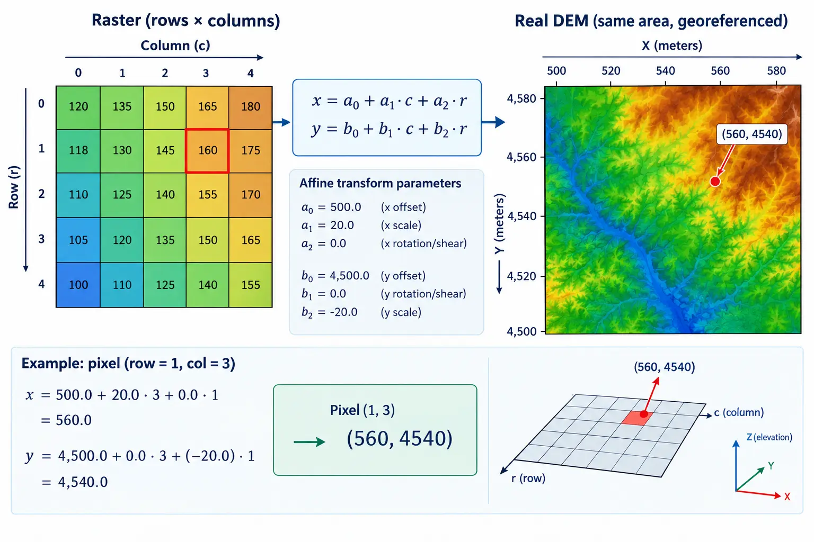

## Introduction

::: {style="text-align: justify;"}
In [**Session 01**](session-01-intro-loading-data.qmd) we opened `dem.tif` and `sentinel.tif` for the first time, and mentioned that every raster carries geographic metadata beyond its pixel values: a coordinate reference system and an affine transform. We deferred that metadata so we could focus on simply getting a raster on screen. This session is where we stop deferring it. We look closely at `.meta`, the affine transform, and the CRS itself, this time reaching for `pyproj` directly rather than only through `rasterio`'s convenience wrappers. By the end of this session we will know, precisely, whether our DEM, our Sentinel image, and our vector boundary actually agree on where they are in the world, and we will have a `raster_utils.py` module that can answer that question for any two files we hand it.
:::

::: {style="text-align: justify;"}
This matters for the solar suitability project specifically because every later factor, slope and aspect from the DEM, land cover from Sentinel, access from the road and power layers, eventually has to be combined pixel by pixel into one suitability map. That is only possible if every layer agrees on where each pixel actually sits on the ground. Getting comfortable with metadata now is what makes [**Session 07**](session-07-resampling-alignment.qmd), where we actually force every layer into agreement, make sense later.
:::

## Full Raster Metadata

::: {style="text-align: justify;"}
`rasterio` exposes a dataset's core metadata as individual attributes, `src.width`, `src.count`, and so on, as we already used in Session 01. It also exposes the same information bundled together as a single dictionary, `src.meta`, which is the form we will reuse most going forward, since it can be passed directly to `rasterio.open()` when writing a new file, as we will do later in this session.
:::

```{python}
import rasterio

dem_path = "data/dem.tif"

with rasterio.open(dem_path) as src:
    meta = src.meta
    print(meta)
```

::: {style="text-align: justify;"}
Each key in this dictionary matters for a different reason. `driver` identifies the file format, almost always `"GTiff"` in this course. `dtype` is the numeric type each pixel is stored as, such as `float32` for a DEM with fractional elevation values, or `uint16` for raw Sentinel digital numbers. `nodata` is the value used to mark pixels with no valid data, for example areas outside a sensor's swath; if this is set incorrectly, or ignored, those pixels will silently pollute any statistic computed later, such as a mean slope. `width`, `height`, and `count` describe the grid shape and number of bands. `crs` and `transform` describe where the grid sits on Earth, which is the focus of the rest of this session.
:::

```{python}
with rasterio.open(dem_path) as src:
    print("Data type:", src.dtypes)
    print("Nodata value:", src.nodata)
    print("Bounds:", src.bounds)
```

::: {.callout-note style="text-align: justify;"}
`src.bounds` returns the geographic extent of the raster as `(left, bottom, right, top)`, in the units of the raster's own CRS. This is different from `src.width` and `src.height`, which are pixel counts, not ground distances. A raster can have the same bounds as another raster while having a completely different width and height, if the two use a different resolution.
:::

### Comparing Bounds Between Our Two Rasters

::: {style="text-align: justify;"}
Since the solar suitability project eventually combines the DEM and the Sentinel image, it is worth checking early whether their extents actually overlap in the first place, before worrying about anything more subtle. We can compare bounds directly, as long as both rasters share the same CRS; if they do not, this comparison is meaningless, which is exactly why the CRS check later in this session has to come first in practice.
:::

```{python}
sentinel_path = "data/sentinel.tif"

with rasterio.open(dem_path) as dem_src, rasterio.open(sentinel_path) as sen_src:
    print("DEM bounds:", dem_src.bounds)
    print("Sentinel bounds:", sen_src.bounds)
    print("DEM CRS:", dem_src.crs)
    print("Sentinel CRS:", sen_src.crs)
```

::: {.callout-important style="text-align: justify;"}
Opening two files at once inside a single `with` statement, separated by a comma, is a common and convenient pattern. Both `dem_src` and `sen_src` close automatically together once the block ends.
:::

## The Affine Transform

::: {style="text-align: justify;"}
The affine transform is the piece of metadata that turns a pixel's row and column index into a real-world coordinate, and back. It is stored as six numbers, and `rasterio` represents it as an `Affine` object.
:::

```{python}
with rasterio.open(dem_path) as src:
    transform = src.transform
    print(transform)
```

::: {style="margin-top: 30px; margin-bottom: 45px; text-align: center;"}
{fig-alt="a diagram showing the six affine transform coefficients laid out as a small matrix, with labeled arrows to pixel size, rotation, and top-left corner coordinate, next to a small pixel grid showing how row/column maps to x/y" width="100%"}
:::

::: {style="text-align: center; margin-top: -25px; margin-bottom: 50px; font-size: 0.85em; opacity: 0.65;"}
*Image generated with GPT Image 2.5.*
:::

::: {style="text-align: justify;"}
Printed out, an `Affine` object shows six values, conventionally labeled `a` through `f`. `a` is the pixel width, how many CRS units wide each pixel is in the x direction. `e` is the pixel height, almost always negative, since raster rows increase downward while y coordinates increase upward. `c` and `f` are the x and y coordinates of the top-left corner of the raster. `b` and `d` handle rotation, and are `0` for almost every raster we will encounter in this course, including all of ours, since our data is not rotated relative to north.
:::

```{python}
with rasterio.open(dem_path) as src:
    transform = src.transform
    print("Pixel width:", transform.a)
    print("Pixel height:", transform.e)
    print("Top-left x:", transform.c)
    print("Top-left y:", transform.f)
```

::: {.callout-tip style="text-align: justify;"}
## Note: resolution from the transform
`transform.a` and `abs(transform.e)` give the raster's spatial resolution directly, the same concept introduced in Session 01. This is a more reliable way to check resolution than assuming it from the file name or documentation, since it comes straight from the file itself.
:::

### Converting Between Pixels and Coordinates

::: {style="text-align: justify;"}
`rasterio` provides two small functions that do this conversion for us, so we rarely need to do the underlying algebra by hand: `src.xy()` converts a row and column into a real-world coordinate, and `src.index()` does the reverse, converting a coordinate into the row and column of the pixel that contains it.
:::

```{python}
with rasterio.open(dem_path) as src:
    x, y = src.xy(0, 0)
    print("Coordinate of pixel (row 0, col 0):", x, y)

    row, col = src.index(x, y)
    print("Pixel containing that coordinate:", row, col)
```

::: {.callout-important style="text-align: justify;"}
`src.xy()` returns the coordinate of the *center* of a pixel, not its corner, by default. This distinction matters when precisely comparing a pixel location against a vector feature, such as checking whether a specific point falls inside a specific DEM cell.
:::

<details>
<summary>Exercise 1: Locate the center pixel</summary>

::: {style="text-align: justify;"}
Open `data/dem.tif`, find the row and column at the exact center of the raster using `src.width` and `src.height`, and print the real-world coordinate of that center pixel using `.xy()`.
:::

<details>
<summary>Solution</summary>

```{python}
with rasterio.open(dem_path) as src:
    center_row = src.height // 2
    center_col = src.width // 2
    center_x, center_y = src.xy(center_row, center_col)

print(f"Center pixel (row {center_row}, col {center_col}) is at: {center_x}, {center_y}")
```

</details>
</details>

## CRS with `pyproj`

::: {style="text-align: justify;"}
`src.crs`, which we already used in Sessions 01 and 02, is actually a `rasterio` wrapper class, `CRS`, rather than a raw `pyproj` object. It behaves similarly for most purposes, but `pyproj` is the library actually doing the coordinate system work underneath, in `rasterio`, `geopandas`, and most of the Python geospatial stack. From this session on, we work with `pyproj.CRS` directly, since it gives us more detail and is the same object we will need in [**Session 07**](session-07-reprojection.qmd) to reproject rasters.
:::

```{python}
from pyproj import CRS

with rasterio.open(dem_path) as src:
    dem_crs = CRS(src.crs)

print(dem_crs)
print("EPSG code:", dem_crs.to_epsg())
print("Is geographic:", dem_crs.is_geographic)
print("Is projected:", dem_crs.is_projected)
```

::: {style="text-align: justify;"}
A geographic CRS, such as `EPSG:4326`, expresses coordinates as longitude and latitude, in degrees, measured on a curved model of the Earth. A projected CRS, such as a UTM zone, flattens that curved surface onto a plane, expressing coordinates in a linear unit, almost always meters. This distinction is the deeper reason `.length` and `.area` returned meaningless-looking numbers back in Session 02, when we computed them on geometries built directly in longitude and latitude: those values were in *degrees*, not meters. Distances and areas are only physically meaningful in a projected CRS.
:::

```{python}
CRS.from_epsg(4326)
```

::: {.callout-tip style="text-align: justify;"}
`CRS.from_epsg()` builds a CRS object directly from a known EPSG code, without needing an open file. This is useful any time we need to construct a target CRS by hand, such as when reprojecting a vector layer, as we already did in Sessions 01 and 02 with `.to_crs()`.
:::

### Checking Every File Against Every Other File

::: {style="text-align: justify;"}
We now have three files that all need to agree eventually: `dem.tif`, `sentinel.tif`, and `Desierto_de_Tabernas.gpkg`. We already saw, in Session 02, that `road.gpkg` and `power.gpkg` did not initially match `boundary.crs`. It is worth checking our full set of files properly here, rather than assuming.
:::

```{python}
import geopandas as gpd

with rasterio.open(dem_path) as src:
    dem_crs = CRS(src.crs)

with rasterio.open(sentinel_path) as src:
    sentinel_crs = CRS(src.crs)

boundary = gpd.read_file("data/Desierto_de_Tabernas.gpkg")
boundary_crs = CRS(boundary.crs)

print("DEM:", dem_crs.to_epsg())
print("Sentinel:", sentinel_crs.to_epsg())
print("Boundary:", boundary_crs.to_epsg())

print("DEM matches Sentinel:", dem_crs == sentinel_crs)
print("DEM matches boundary:", dem_crs == boundary_crs)
```

::: {.callout-warning style="text-align: justify;"}
## Note: comparing CRS objects directly
Two `CRS` objects can be compared with `==` directly, as shown above, and this is generally more reliable than comparing EPSG codes, since not every CRS has a clean EPSG code. Comparing the raw `.to_epsg()` values is fine here since both of ours have one, but get in the habit of comparing the `CRS` objects themselves.
:::

### Transforming a Single Point with `pyproj.Transformer`

::: {style="text-align: justify;"}
Sometimes we need to convert a single coordinate from one CRS to another, without reprojecting an entire file. `Transformer.from_crs()` builds a reusable converter between two coordinate systems, and its `.transform()` method converts one coordinate at a time.
:::

```{python}
from pyproj import Transformer

transformer = Transformer.from_crs(dem_crs, "EPSG:4326", always_xy=True)

with rasterio.open(dem_path) as src:
    x, y = src.xy(0, 0)

lon, lat = transformer.transform(x, y)
print(f"Pixel (0, 0) is at {x}, {y} in the DEM's CRS")
print(f"That is longitude {lon}, latitude {lat}")
```

::: {.callout-important style="text-align: justify;"}
## Note: `always_xy=True`
Some CRS definitions traditionally order coordinates as latitude, longitude rather than longitude, latitude. Passing `always_xy=True` forces `pyproj` to consistently expect and return coordinates in x, y order, which for a geographic CRS means longitude, latitude. Leaving this out is a common source of coordinates that look plausible but are silently swapped.
:::

::: {style="text-align: justify;"}
This is only a preview. Converting a single point this way is useful for quick checks, such as confirming a pixel's location on a normal longitude and latitude map, but it is not how we reproject an entire raster. Reprojecting the full DEM or Sentinel image, resampling every pixel onto a new grid, is a more involved operation that we deliberately save for [**Session 07**](session-07-resampling-alignment.qmd), once every layer in the project is ready to be aligned at once.
:::

<details>
<summary>Exercise 2: Where is the DEM's center pixel, really?</summary>

::: {style="text-align: justify;"}
Using the center pixel coordinate you found in Exercise 1, build a `Transformer` from the DEM's CRS to `EPSG:4326`, and print the resulting longitude and latitude.
:::

<details>
<summary>Solution</summary>

```{python}
with rasterio.open(dem_path) as src:
    dem_crs = CRS(src.crs)
    center_row = src.height // 2
    center_col = src.width // 2
    center_x, center_y = src.xy(center_row, center_col)

transformer = Transformer.from_crs(dem_crs, "EPSG:4326", always_xy=True)
center_lon, center_lat = transformer.transform(center_x, center_y)

print(f"DEM center pixel: longitude {center_lon}, latitude {center_lat}")
```

</details>
</details>

### Quick quiz

<details>
<summary>Question 1</summary>

::: {style="text-align: justify;"}
Why do `.length` and `.area` return meaningless values for a geometry built directly in longitude and latitude coordinates?
:::

A. `shapely` does not support geographic coordinates at all

B. The values are returned in degrees, not meters, since a geographic CRS is not a linear unit

C. `shapely` always assumes UTM internally

D. The geometry must be invalid

<details>
<summary>Answer</summary>
B. A geographic CRS such as `EPSG:4326` measures coordinates in degrees. `shapely` and `geopandas` compute `.length` and `.area` purely from the numbers they are given, with no awareness of the CRS, so the result is technically correct but expressed in degrees, a unit with no consistent physical length. A projected CRS, in meters, is required for a physically meaningful distance or area.
</details>
</details>

## Multi-band Inspection

::: {style="text-align: justify;"}
`sentinel.tif` holds several bands stacked together, as introduced in Session 01. Before we calculate anything from them, such as NDVI in [**Session 04**](session-04-ndvi.qmd), it helps to inspect each band individually: its description, if the file provides one, and basic statistics.
:::

```{python}
with rasterio.open(sentinel_path) as src:
    for band_index in range(1, src.count + 1):
        description = src.descriptions[band_index - 1]
        print(f"Band {band_index}: {description}")
```

::: {.callout-note style="text-align: justify;"}
Not every GeoTIFF stores band descriptions; when a file does not, `src.descriptions` returns `None` for each band, and the only way to identify a band is by its position, or by comparing basic statistics against known expectations, as we do next.
:::

```{python}
import numpy as np

with rasterio.open(sentinel_path) as src:
    for band_index in range(1, src.count + 1):
        band = src.read(band_index)
        print(f"Band {band_index}: min={band.min()}, max={band.max()}, mean={band.mean():.2f}")
```

::: {style="text-align: justify;"}
This is the same technique introduced briefly in Session 01, now applied deliberately to every band at once. A near-infrared band, for example, typically has noticeably higher reflectance over vegetation than a red or blue band, which is a useful sanity check for confirming band order before relying on it in Session 04.
:::

## Plotting DEM and Sentinel Side by Side

::: {style="text-align: justify;"}
Session 01 plotted the Sentinel image and the DEM separately, each with the study boundary drawn on top. Now that we understand bounds and CRS properly, it is worth placing both rasters side by side in a single figure, which makes any mismatch between them, in extent or in CRS, immediately visible.
:::

::: {style="text-align: justify;"}
`rasterio.plot.show`, passed a multi-band dataset directly, builds its composite from the raw values of the first three bands with no adjustment. Sentinel-2 reflectance values are naturally low and concentrated in a narrow range, which is exactly why the raw composite in Session 01 looked almost black. A gamma correction stretches that narrow range of dark values back out into something the eye can actually distinguish, without changing the underlying data on disk, only how it is displayed here.
:::

```{python}
import matplotlib.pyplot as plt
from rasterio.plot import show

boundary = gpd.read_file("data/Desierto_de_Tabernas.gpkg")


def gamma_stretch(band, gamma=0.5):
    """Normalize a band to 0-1 using percentile clipping, then apply gamma correction for display."""
    band = band.astype("float32")
    low, high = np.percentile(band, (2, 98))
    stretched = np.clip((band - low) / (high - low), 0, 1)
    return stretched ** gamma


fig, axes = plt.subplots(1, 2, figsize=(14, 7))

with rasterio.open(sentinel_path) as src:
    boundary_sen = boundary.to_crs(src.crs) if boundary.crs != src.crs else boundary
    rgb = np.dstack([gamma_stretch(src.read(band)) for band in (1, 2, 3)])
    axes[0].imshow(rgb, extent=rasterio.plot.plotting_extent(src))
    boundary_sen.boundary.plot(ax=axes[0], edgecolor="red", linewidth=1.5)
    axes[0].set_title("Sentinel-2 (gamma corrected)")

with rasterio.open(dem_path) as src:
    boundary_dem = boundary.to_crs(src.crs) if boundary.crs != src.crs else boundary
    dem_plot = show(src, ax=axes[1], cmap="terrain")
    boundary_dem.boundary.plot(ax=axes[1], edgecolor="red", linewidth=1.5)
    axes[1].set_title("DEM")

plt.tight_layout()
plt.show()
```

::: {.callout-tip style="text-align: justify;"}
## Note: `gamma_stretch` is a display helper, not a saved product
`gamma_stretch` only reshapes values for this plot; it is never written back to a GeoTIFF, and nothing about `sentinel.tif` itself changes. `rasterio.plot.plotting_extent(src)` gives `imshow` the same geographic extent `show()` would have used automatically, which is why the boundary still lines up correctly on top of it.
:::

::: {style="text-align: justify;"}
A colorbar is often expected alongside a DEM plot, since, unlike a natural color Sentinel composite, the colors carry no intuitive meaning on their own; a reader needs the scale to know what elevation a given shade of green or brown represents. `rasterio.plot.show` returns the underlying `matplotlib` image object, which we can pass directly to `plt.colorbar()`.
:::

```{python}
fig, ax = plt.subplots(figsize=(8, 8))

with rasterio.open(dem_path) as src:
    dem_image = show(src, ax=ax, cmap="terrain")

im = dem_image.get_images()[0]
plt.colorbar(im, ax=ax, label="Elevation (m)", shrink=0.7)
ax.set_title("DEM with Elevation Colorbar")
plt.show()
```

<details>
<summary>Exercise 3: Add a colorbar to a single band</summary>

::: {style="text-align: justify;"}
Read only the first band of `sentinel.tif` as a single 2D array with `src.read(1)`, display it with `plt.imshow()` using the colormap `"viridis"`, and attach a colorbar labeled `"Reflectance"`.
:::

<details>
<summary>Solution</summary>

```{python}
with rasterio.open(sentinel_path) as src:
    band_1 = src.read(1)

fig, ax = plt.subplots(figsize=(7, 7))
im = ax.imshow(band_1, cmap="viridis")
plt.colorbar(im, ax=ax, label="Reflectance", shrink=0.7)
ax.set_title("Sentinel-2, Band 1")
plt.show()
```

</details>
</details>

## Writing a Raster

::: {style="text-align: justify;"}
Every session from Session 04 onward produces a new raster: `ndvi.tif`, `slope.tif`, `aspect.tif`, and eventually `suitability.tif`. This is the right moment to learn the write side of `rasterio`, on a small, low-stakes example, before we depend on it for a real output.
:::

::: {style="text-align: justify;"}
The general pattern is to start from an existing file's `.meta`, update only the keys that change, such as `dtype` or `count` if needed, and pass the result to `rasterio.open()` in write mode.
:::

```{python}
with rasterio.open(dem_path) as src:
    dem_array = src.read(1)
    profile = src.profile

cropped = dem_array[:100, :100]

crop_window = rasterio.windows.Window(0, 0, cropped.shape[1], cropped.shape[0])

profile.update({
    "height": cropped.shape[0],
    "width": cropped.shape[1],
    "transform": rasterio.windows.transform(crop_window, profile["transform"]),
})

from pathlib import Path
Path("data/outputs").mkdir(parents=True, exist_ok=True)

with rasterio.open("data/outputs/dem_crop_test.tif", "w", **profile) as dst:
    dst.write(cropped, 1)

print("Saved cropped test raster to data/outputs/dem_crop_test.tif")
```

::: {.callout-important style="text-align: justify;"}
## Note: `profile` versus `meta`
`src.profile` is almost identical to `src.meta`, with a couple of extra keys geared toward writing, such as compression settings. Either works as a starting point; this course uses `profile` specifically when writing a file, and `meta` when only inspecting one, purely as a readability convention.
:::

::: {.callout-warning style="text-align: justify;"}
Cropping an array with slicing, as done above, changes its shape, which means the transform must be updated to match, or every pixel in the new file will report the wrong coordinates. `rasterio.windows.transform()` computes the correct new transform for a given pixel window. We use this pattern properly, cropping to the full study boundary rather than an arbitrary corner, once we reach clipping in a later session.
:::

<details>
<summary>Exercise 4: Verify the written file</summary>

::: {style="text-align: justify;"}
Open `data/outputs/dem_crop_test.tif`, the file just written, and print its width, height, and CRS, to confirm it was saved correctly.
:::

<details>
<summary>Solution</summary>

```{python}
with rasterio.open("data/outputs/dem_crop_test.tif") as src:
    print("Width:", src.width)
    print("Height:", src.height)
    print("CRS:", src.crs)
```

</details>
</details>

## Building `raster_utils.py`

::: {style="text-align: justify;"}
This session's module wraps the metadata and CRS checks above into reusable functions, saved into `modules/raster_utils.py`. Later sessions, starting with `indices.py` in Session 04, will `import` from both `data_loader.py` and `raster_utils.py` rather than repeating these steps.
:::

```python
# modules/raster_utils.py

import rasterio
from pyproj import CRS


def get_raster_info(path):
    """Return a dictionary of key metadata for a raster file."""
    with rasterio.open(path) as src:
        info = {
            "width": src.width,
            "height": src.height,
            "count": src.count,
            "dtype": src.dtypes[0],
            "nodata": src.nodata,
            "crs": CRS(src.crs),
            "bounds": src.bounds,
            "transform": src.transform,
        }
    print(f"{path}: {info['width']}x{info['height']}, {info['count']} band(s), CRS {info['crs'].to_epsg()}")
    return info


def check_crs_match(path1, path2):
    """Compare the CRS of two raster files and report whether they match."""
    with rasterio.open(path1) as src1:
        crs1 = CRS(src1.crs)
    with rasterio.open(path2) as src2:
        crs2 = CRS(src2.crs)

    match = crs1 == crs2
    status = "match" if match else "DO NOT match"
    print(f"{path1} and {path2} {status} ({crs1.to_epsg()} vs {crs2.to_epsg()})")
    return match


def save_raster(array, profile, path):
    """Write a NumPy array to disk as a raster, using a given rasterio profile."""
    updated_profile = profile.copy()
    updated_profile.update({
        "height": array.shape[0],
        "width": array.shape[1],
    })

    with rasterio.open(path, "w", **updated_profile) as dst:
        dst.write(array, 1)

    print(f"Saved raster to {path}")
```

::: {.callout-tip style="text-align: justify;"}
`save_raster` assumes a single-band array, which matches every output the rest of this course produces: `ndvi.tif`, `slope.tif`, `aspect.tif`, and `suitability.tif` are all single-band rasters. It intentionally does not update `transform`, since it assumes the array has the same extent as the original file the profile was taken from; a cropped array, as in the example earlier in this session, needs its transform corrected separately first.
:::

## Summary

::: {style="text-align: justify;"}
This session went beneath the surface of the raster metadata we glossed over in Session 01: the full `.meta` dictionary, the affine transform and what its six values mean, converting between pixel indices and real-world coordinates, and `pyproj.CRS` as the library actually responsible for coordinate systems underneath `rasterio` and `geopandas`. We confirmed how our DEM, Sentinel image, and study boundary relate to one another in CRS terms, previewed converting a single coordinate between CRS with `pyproj.Transformer`, inspected each Sentinel band individually, improved our raster plots with colorbars and side-by-side comparisons, and wrote our first raster to disk. We also built `modules/raster_utils.py`, which the rest of the course will rely on. [**Session 04**](session-04-ndvi.qmd) puts all of this to use, calculating NDVI from the Sentinel bands we inspected here and saving it as `ndvi.tif` with the exact write pattern practiced in this session.
:::