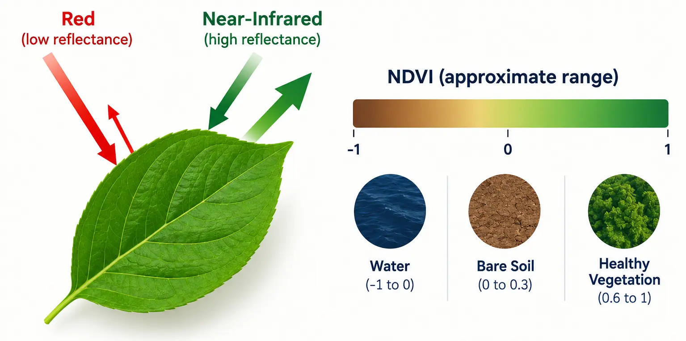
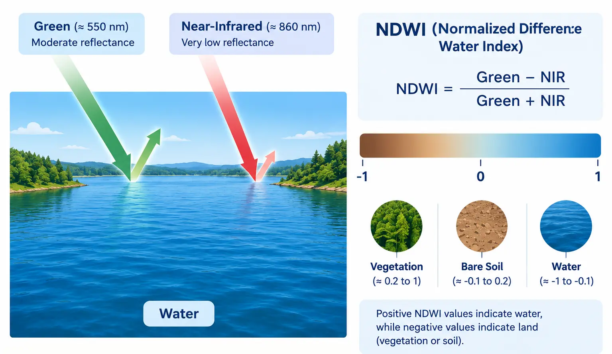

## Introduction

::: {style="text-align: justify;"}
Every session so far has been about opening, inspecting, and displaying data that already existed on disk. This session is where we start *creating* new data. `sentinel.tif` carries several spectral bands, each one a full 2D grid of reflectance values, and a spectral index is simply a formula applied to two or more of those bands, pixel by pixel, producing a brand new single-band raster. We build two of them here: NDVI, which tells us how much healthy vegetation is present at each pixel, and NDWI, which tells us how much water is present. Both matter directly for the solar suitability project: NDVI feeds one of our four suitability factors, land cover, while NDWI gives us something NDVI cannot, a reliable way to identify water so it can be excluded from consideration entirely later on.
:::

::: {style="text-align: justify;"}
Nothing in this session is conceptually new. Reading a band with `rasterio` is exactly what we did in [**Session 01**](session-01-intro-loading-data.qmd) and [**Session 03**](session-03-raster-metadata-crs.qmd). The vectorized array math is exactly what we practiced with NumPy in [**Session 00**](session-00-python-review.qmd). What this session adds is putting those two things together, deliberately, to produce a real scientific output, and doing it carefully enough to avoid the most common mistake in band math: dividing by zero.
:::

## NDVI: The Normalized Difference Vegetation Index

::: {style="text-align: justify;"}
NDVI is defined as:
:::

$$
NDVI = \frac{NIR - Red}{NIR + Red}
$$

::: {style="text-align: justify;"}
The formula works because of a simple, consistent fact about how healthy vegetation reflects light. Chlorophyll in a healthy leaf absorbs most red light for photosynthesis, so red reflectance stays low, while the internal cell structure of the leaf strongly reflects near-infrared light, so NIR reflectance is high. Subtracting and normalizing the two turns that gap into a single number: healthy, dense vegetation pushes NDVI toward 1, bare soil and rock sit close to 0, and water, which reflects very little in either band but even less in NIR, produces negative values. The full range of NDVI is always between -1 and 1, regardless of the sensor or the units of the original reflectance values, which is exactly what makes it comparable across different images and different dates.
:::

::: {style="margin-top: 30px; margin-bottom: 45px; text-align: center;"}
{fig-alt="a simple diagram showing a healthy leaf with arrows illustrating high near-infrared reflectance and low red reflectance, next to a small scale from -1 to 1 labeled with water, bare soil, and healthy vegetation" width="100%"}
:::

::: {style="text-align: center; margin-top: -25px; margin-bottom: 50px; font-size: 0.85em; opacity: 0.65;"}
*Image generated with GPT Image 2.5.*
:::

::: {style="text-align: justify;"}
For the solar suitability project specifically, NDVI is what lets us tell bare, scrubby desert apart from forest or farmland: low NDVI is exactly the kind of land that makes a good solar site, since it means little vegetation would need to be cleared and the land is not already in agricultural use.
:::

## NDWI: The Normalized Difference Water Index

::: {style="text-align: justify;"}
NDWI is defined as:
:::

$$
NDWI = \frac{Green - NIR}{Green + NIR}
$$

::: {style="text-align: justify;"}
The logic mirrors NDVI, but with the opposite pair of bands. Water reflects a moderate amount of green light but absorbs almost all near-infrared light, the opposite pattern from vegetation. So water pixels produce high, positive NDWI values, while vegetation and bare soil, which both reflect relatively strongly in NIR, produce low or negative NDWI values.
:::

::: {style="margin-top: 30px; margin-bottom: 45px; text-align: center;"}
{fig-alt="a simple diagram showing a body of water with arrows illustrating moderate green reflectance and very low near-infrared reflectance, next to a small scale from -1 to 1 labeled with vegetation/soil and water" width="100%"}
:::

::: {style="text-align: center; margin-top: -25px; margin-bottom: 50px; font-size: 0.85em; opacity: 0.65;"}
*Image generated with GPT Image 2.5.*
:::

::: {.callout-important style="text-align: justify;"}
## Note: NDWI is used differently from NDVI in this project
NDVI feeds directly into the suitability *score*, as a continuous factor: lower NDVI means a higher land cover score. NDWI is not used that way. A pixel sitting in a seasonal riverbed is not "less suitable", it is simply not a candidate at all, regardless of how every other factor scores. NDWI's role here is to build an **exclusion mask**, a set of pixels removed from consideration entirely, rather than a factor that nudges a score up or down. We build that mask later in this session, and it is applied for real once we reach the weighted overlay in [**Session 08**](session-08-suitability-model.qmd).
:::

## Identifying the Right Bands

::: {style="text-align: justify;"}
In [**Session 03**](session-03-raster-metadata-crs.qmd) we inspected `sentinel.tif`'s bands individually, checking `src.descriptions` and basic statistics to understand what each one held. NDVI and NDWI both need us to know exactly which band index corresponds to Red, Green, and NIR in our specific file, since band order is not guaranteed to match the sensor's own numbering once a file has been subset or reordered during preprocessing.
:::

```{python}
import rasterio

sentinel_path = "data/sentinel.tif"

with rasterio.open(sentinel_path) as src:
    for band_index in range(1, src.count + 1):
        description = src.descriptions[band_index - 1]
        print(f"Band {band_index}: {description}")
```

::: {.callout-note style="text-align: justify;"}
For our `sentinel.tif`, the bands map as follows: **band 1 is Blue, band 2 is Green, band 3 is Red, band 4 is NIR**. This is not the full 13-band Sentinel-2 product, only the four bands our project actually needs, already extracted and reordered. Always confirm this mapping against your own file's `src.descriptions` rather than assuming, since a different export could easily order or select bands differently.
:::

```{python}
RED_BAND = 3
GREEN_BAND = 2
NIR_BAND = 4
```

## Reading the Bands as Arrays

::: {style="text-align: justify;"}
With the mapping confirmed, we read the three bands we need directly into NumPy arrays, converting to `float32` immediately. Sentinel data is normally stored as an unsigned integer type such as `uint16`; if we perform subtraction and division on integer arrays directly, the result silently truncates and produces wrong values, so this conversion has to happen before any math.
:::

```{python}
with rasterio.open(sentinel_path) as src:
    red = src.read(RED_BAND).astype("float32")
    green = src.read(GREEN_BAND).astype("float32")
    nir = src.read(NIR_BAND).astype("float32")
    profile = src.profile

print("Array shape:", red.shape)
print("Red dtype:", red.dtype)
```

## Handling Division by Zero

::: {style="text-align: justify;"}
Both formulas divide by a sum of two bands. Wherever that sum is exactly zero, typically in `nodata` regions at the edge of an image, standard NumPy division either raises a runtime warning or produces `inf` and `nan` values scattered through the result. We handle this deliberately with `np.errstate`, which suppresses the warning, combined with `np.where`, which explicitly assigns a safe value, `0`, to every pixel where the denominator is zero, instead of letting NumPy decide.
:::

```{python}
import numpy as np

def safe_divide(numerator, denominator):
    """Divide two arrays element-wise, returning 0 wherever the denominator is 0."""
    with np.errstate(divide="ignore", invalid="ignore"):
        result = np.where(denominator != 0, numerator / denominator, 0)
    return result
```

::: {.callout-warning style="text-align: justify;"}
## Note: why not just ignore the warning?
Silencing the warning with `np.errstate` only stops NumPy from printing it; it does not fix the underlying `nan` or `inf` values. `np.where` is what actually replaces them with a defined value. Skipping this step is one of the most common sources of a suitability map with unexplained black or white streaks along its edges later in the course.
:::

## Calculating NDVI and NDWI

::: {style="text-align: justify;"}
With `safe_divide` in place, both formulas become a single vectorized line each, no loops, applied to every pixel in the array at once, exactly the pattern practiced in [**Session 00**](session-00-python-review.qmd).
:::

```{python}
def calculate_ndvi(red, nir):
    """Calculate NDVI from red and near-infrared bands."""
    return safe_divide(nir - red, nir + red)


def calculate_ndwi(green, nir):
    """Calculate NDWI from green and near-infrared bands."""
    return safe_divide(green - nir, green + nir)


ndvi = calculate_ndvi(red, nir)
ndwi = calculate_ndwi(green, nir)

print("NDVI range:", ndvi.min(), "to", ndvi.max())
print("NDWI range:", ndwi.min(), "to", ndwi.max())
```

## Visualizing Both Indices

::: {style="text-align: justify;"}
`"RdYlGn"` is a natural colormap choice for NDVI, since it runs from red through yellow to green, matching low to high vegetation intuitively. For NDWI, `"Blues"` communicates the same idea for water: low values stay pale, high values, likely water, turn a deep blue. We display both side by side, following the same subplot and colorbar pattern from [**Session 03**](session-03-raster-metadata-crs.qmd).
:::

```{python}
import matplotlib.pyplot as plt

fig, axes = plt.subplots(1, 2, figsize=(14, 6))

ndvi_im = axes[0].imshow(ndvi, cmap="RdYlGn", vmin=-1, vmax=1)
axes[0].set_title("NDVI")
plt.colorbar(ndvi_im, ax=axes[0], label="NDVI", shrink=0.7)

ndwi_im = axes[1].imshow(ndwi, cmap="Blues", vmin=-1, vmax=1)
axes[1].set_title("NDWI")
plt.colorbar(ndwi_im, ax=axes[1], label="NDWI", shrink=0.7)

plt.tight_layout()
plt.show()
```

## Histograms: Looking at the Distribution, Not Just the Map

::: {style="text-align: justify;"}
A map shows *where* values fall, but a histogram shows *how many* pixels fall into each value range, which is often the faster way to judge whether an index behaved as expected before trusting it further. `plt.hist()` takes a flattened array directly.
:::

```{python}
fig, axes = plt.subplots(1, 2, figsize=(14, 4))

axes[0].hist(ndvi.flatten(), bins=50, color="seagreen")
axes[0].set_title("NDVI Distribution")
axes[0].set_xlabel("NDVI")
axes[0].set_ylabel("Pixel count")

axes[1].hist(ndwi.flatten(), bins=50, color="steelblue")
axes[1].set_title("NDWI Distribution")
axes[1].set_xlabel("NDWI")
axes[1].set_ylabel("Pixel count")

plt.tight_layout()
plt.show()
```

::: {.callout-tip style="text-align: justify;"}
## Note: what a healthy histogram looks like here
For a mostly arid, sparsely vegetated study area such as Desierto de Tabernas, expect the NDVI histogram to bunch up close to 0, with only a small tail reaching toward higher values, and the NDWI histogram to sit almost entirely below 0, with at most a thin spike near the top representing any seasonal water. A histogram that instead shows most pixels near the extremes, -1 or 1, on either index, is usually a sign that the wrong bands were used, or that the division-by-zero handling above did not run.
:::

## Building a Water Mask from NDWI

::: {style="text-align: justify;"}
A common convention is that any pixel with NDWI above 0 is more likely water than not. This is only a starting threshold, not a scientifically fixed cutoff, but it is a reasonable default for now. We build the mask the same way we filtered NumPy arrays with boolean conditions back in [**Session 00**](session-00-python-review.qmd).
:::

```{python}
water_mask = ndwi > 0

water_pixel_count = np.sum(water_mask)
total_pixel_count = water_mask.size
water_percentage = (water_pixel_count / total_pixel_count) * 100

print(f"Water pixels: {water_pixel_count} out of {total_pixel_count} ({water_percentage:.2f}%)")
```

```{python}
fig, ax = plt.subplots(figsize=(7, 7))
ax.imshow(water_mask, cmap="Blues")
ax.set_title(f"Water Mask (NDWI > 0), {water_percentage:.2f}% of pixels")
plt.show()
```

::: {style="text-align: justify;"}
This mask is not applied to anything yet, we are only building and inspecting it here. It gets used for real once every layer is aligned and combined into the final suitability score in [**Session 08**](session-08-suitability-model.qmd), where any pixel flagged here as water is removed from consideration entirely, before scoring even happens.
:::

<details>
<summary>Exercise 1: What fraction counts as vegetated?</summary>

::: {style="text-align: justify;"}
Using the `ndvi` array calculated above, count how many pixels have NDVI above 0.3, a common threshold for meaningful vegetation, and print that count as a percentage of all pixels.
:::

<details>
<summary>Solution</summary>

```{python}
vegetation_mask = ndvi > 0.3
vegetation_percentage = (np.sum(vegetation_mask) / vegetation_mask.size) * 100

print(f"Vegetated pixels: {vegetation_percentage:.2f}%")
```

</details>
</details>

<details>
<summary>Exercise 2: Compare the two histograms side by side with a shared x-axis</summary>

::: {style="text-align: justify;"}
Re-plot the NDVI and NDWI histograms from earlier in this session, but this time on the *same* axes, in different colors, with a legend, so the two distributions can be compared directly.
:::

<details>
<summary>Solution</summary>

```{python}
fig, ax = plt.subplots(figsize=(8, 5))
ax.hist(ndvi.flatten(), bins=50, alpha=0.6, label="NDVI", color="seagreen")
ax.hist(ndwi.flatten(), bins=50, alpha=0.6, label="NDWI", color="steelblue")
ax.set_xlabel("Index value")
ax.set_ylabel("Pixel count")
ax.legend()
ax.set_title("NDVI vs NDWI Distribution")
plt.show()
```

</details>
</details>

### Quick quiz

<details>
<summary>Question 1</summary>

::: {style="text-align: justify;"}
Why does NDWI get used as an exclusion mask in this project, rather than as a continuous scoring factor the way NDVI is?
:::

A. Because NDWI cannot be calculated from Sentinel-2 bands

B. Because a water pixel is not simply "less suitable", it should not be considered a candidate site at all

C. Because NDWI values are always exactly 0 or 1

D. Because NDWI and NDVI use the same two bands, so only one can be used

<details>
<summary>Answer</summary>
B. NDVI describes a spectrum of vegetation density, where less vegetation genuinely means a somewhat better solar site, which fits a continuous score. Water is a binary, hard constraint: a pixel is either a candidate location or it is not, so it makes more sense as a mask that removes pixels entirely than as a factor that lowers their score.
</details>
</details>

## Saving the Results

::: {style="text-align: justify;"}
Both indices get written to disk using the exact write pattern practiced in [**Session 03**](session-03-raster-metadata-crs.qmd): start from the source file's profile, update the keys that changed, and write. NDVI and NDWI are both continuous values between -1 and 1, so the output dtype has to be `float32`, not the `uint16` of the original Sentinel bands.
:::

```{python}
from pathlib import Path

Path("data/outputs").mkdir(parents=True, exist_ok=True)

output_profile = profile.copy()
output_profile.update({"dtype": "float32", "count": 1, "nodata": None})

with rasterio.open("data/outputs/ndvi.tif", "w", **output_profile) as dst:
    dst.write(ndvi, 1)

with rasterio.open("data/outputs/ndwi.tif", "w", **output_profile) as dst:
    dst.write(ndwi, 1)

print("Saved ndvi.tif and ndwi.tif to data/outputs/")
```

## Building `indices.py`

::: {style="text-align: justify;"}
This session's module collects everything above into reusable functions, saved into `modules/indices.py`. It reuses `save_raster` from `modules/raster_utils.py`, built in [**Session 03**](session-03-raster-metadata-crs.qmd), rather than repeating the write logic again here.
:::

```python
# modules/indices.py

import rasterio
import numpy as np


def safe_divide(numerator, denominator):
    """Divide two arrays element-wise, returning 0 wherever the denominator is 0."""
    with np.errstate(divide="ignore", invalid="ignore"):
        result = np.where(denominator != 0, numerator / denominator, 0)
    return result


def calculate_ndvi(red, nir):
    """Calculate NDVI from red and near-infrared bands."""
    return safe_divide(nir - red, nir + red)


def calculate_ndwi(green, nir):
    """Calculate NDWI from green and near-infrared bands."""
    return safe_divide(green - nir, green + nir)


def load_and_calculate_indices(sentinel_path, red_band, green_band, nir_band):
    """Read the required bands from a Sentinel file and return NDVI, NDWI, and the source profile."""
    with rasterio.open(sentinel_path) as src:
        red = src.read(red_band).astype("float32")
        green = src.read(green_band).astype("float32")
        nir = src.read(nir_band).astype("float32")
        profile = src.profile

    ndvi = calculate_ndvi(red, nir)
    ndwi = calculate_ndwi(green, nir)

    return ndvi, ndwi, profile
```

::: {.callout-tip style="text-align: justify;"}
`load_and_calculate_indices` is deliberately the only function here that opens a file; `calculate_ndvi` and `calculate_ndwi` work on plain NumPy arrays and know nothing about `rasterio`, which keeps them easy to test and reuse, for example in [**Session 08**](session-08-suitability-model.qmd) when we combine multiple indices into a single suitability score.
:::

## A Look Ahead: `xarray` and `rioxarray`

::: {style="text-align: justify;"}
Everything in this session worked directly with `rasterio` and plain NumPy arrays: a raster's pixel values and its geographic metadata, the CRS and transform, were always two separate things that we had to keep track of and pass around ourselves, exactly as we did with `profile` a moment ago. This is deliberate for a course focused on building intuition for what a raster actually is underneath. It is worth knowing, though, that a large part of the Python geospatial ecosystem has moved toward a library that fuses the two together.
:::

::: {style="text-align: justify;"}
[`xarray`](https://docs.xarray.dev/) is a general-purpose library for working with labeled, multi-dimensional arrays, originally built for climate and atmospheric science, where a single dataset might have dimensions for latitude, longitude, time, and elevation all at once, each one labeled rather than just numbered. [`rioxarray`](https://corteva.github.io/rioxarray/stable/) extends `xarray` with exactly the geospatial pieces `rasterio` provides: CRS, transform, and raster I/O, attached directly to the array itself as metadata that travels with it automatically.
:::

::: {style="text-align: justify;"}
Concretely, this means a raster opened with `rioxarray` remembers its own CRS and transform without a separate `profile` dictionary being carried around by hand, and an operation such as clipping to a boundary, reprojecting, or computing NDVI can be written in a single readable expression instead of several explicit steps. For a project with only two rasters and a handful of derived layers, the way we have built things this session is easy to follow and debug. For much larger projects, especially ones involving many time steps or many bands at once, `rioxarray` often becomes the more practical choice, and the concepts from this course, bands, CRS, transforms, nodata, translate directly, since `rioxarray` is built on top of `rasterio` rather than replacing the ideas it represents.
:::

::: {.callout-note style="text-align: justify;"}
We do not switch to `rioxarray` in this course, since building the raster mental model by hand, the way we have been doing, pays off more for learning than it costs in convenience. If you want to explore it on your own afterward, the [`rioxarray` getting started guide](https://corteva.github.io/rioxarray/stable/getting_started/getting_started.html) and the [`xarray` documentation](https://docs.xarray.dev/en/stable/) are both good starting points.
:::

## Summary

::: {style="text-align: justify;"}
This session produced our first derived raster outputs: NDVI, capturing vegetation density from the Red and NIR bands, and NDWI, capturing water presence from the Green and NIR bands, both computed with vectorized NumPy math and carefully guarded against division by zero. We visualized both as maps and as histograms, built a water mask from NDWI that will later become a real exclusion in the suitability score, and saved both indices as GeoTIFFs following the write pattern from [**Session 03**](session-03-raster-metadata-crs.qmd). We also built `modules/indices.py`, and took a brief look at `xarray` and `rioxarray` as a more integrated alternative to the `rasterio` and NumPy workflow used throughout this course. [**Session 05**](session-05-slope-aspect.qmd) turns to the DEM, calculating slope and aspect, the two terrain-based factors of our suitability score.
:::