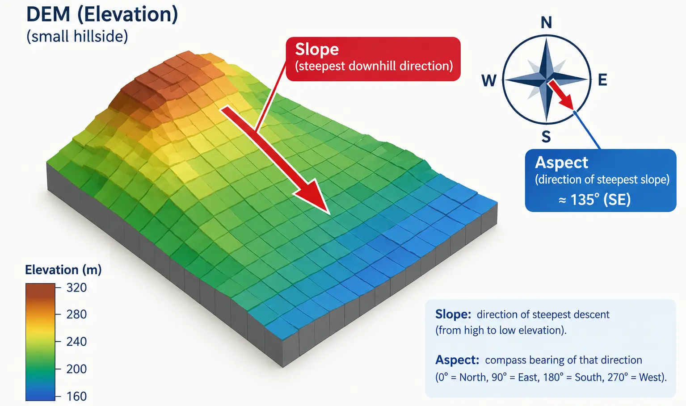

## Introduction

::: {style="text-align: justify;"}
[**Session 04**](session-04-ndvi.qmd) turned Sentinel bands into NDVI and NDWI, two flat, per-pixel formulas applied to spectral values. This session works with a single band, the DEM, but the math is a different kind of operation entirely: instead of comparing two bands at the same pixel, we compare each pixel to its neighbors, since slope and aspect are both properties of how elevation changes across space, not properties of a single elevation value on its own. This is the first time in the course we calculate something from a raster's spatial structure rather than its spectral content, and that distinction is worth sitting with before writing any code.
:::

::: {style="text-align: justify;"}
Slope and aspect are two of the four suitability factors for the project: a gentle slope keeps installation and maintenance costs down, and a south facing slope, in the northern hemisphere, receives more direct sunlight across the day than a north facing one. Both come from the same DEM, and both come from the same underlying calculation, a gradient, so we build them together in this session.
:::

## From Elevation to Gradient

::: {style="text-align: justify;"}
A DEM gives us elevation, a single value per pixel. Slope and aspect both need to know how that elevation *changes* as we move across the grid, in the east-west direction and in the north-south direction. This rate of change is called a gradient, and it is calculated the same way a derivative is calculated in calculus: the difference in value between two nearby points, divided by the distance between them.
:::

::: {style="text-align: justify;"}
For a raster, "nearby points" means neighboring pixels, and "distance between them" means the pixel's spatial resolution, the same value we pulled from `transform.a` and `transform.e` back in [**Session 03**](session-03-raster-metadata-crs.qmd). This is the one detail that is easy to forget and produces a slope that looks plausible but is quantitatively wrong: the gradient has to be computed in real ground units, meters per meter, not in pixels per pixel.
:::

::: {style="margin-top: 30px; margin-bottom: 45px; text-align: center;"}
{fig-alt="a simple 3D-style diagram of a small hillside DEM grid, with one arrow showing the steepest downhill direction labeled slope, and a compass rose showing that same direction's compass bearing labeled aspect" width="100%"}
:::

::: {style="text-align: center; margin-top: -25px; margin-bottom: 50px; font-size: 0.85em; opacity: 0.65;"}
*Image generated with GPT Image 2.5.*
:::

```{python}
import rasterio
import numpy as np

dem_path = "data/dem.tif"

with rasterio.open(dem_path) as src:
    dem = src.read(1).astype("float32")
    transform = src.transform
    profile = src.profile
    crs = src.crs
    bounds = src.bounds

print("CRS:", crs)
print("Is geographic:", crs.is_geographic)
print(transform)
```

::: {.callout-warning style="text-align: justify;"}
## Note: check this before trusting any slope value
Our `dem.tif` uses `EPSG:4326`, a geographic CRS, exactly the case flagged as risky back in [**Session 03**](session-03-raster-metadata-crs.qmd). `transform.a` and `transform.e` here are tiny numbers, around 0.001, because they are measured in degrees, not meters, while every elevation value in the array is in meters. Feeding a meter-scale elevation difference straight into a degree-scale spacing produces a gradient many orders of magnitude too large, and `arctan` of a huge number saturates at 90 degrees. This is exactly why a first attempt at this calculation often produces a slope map that shows nearly every pixel at 90 degrees, a uniform, clearly wrong result, and a completely empty gentle-slope mask afterward. Always check `src.crs.is_geographic` before treating `transform.a`/`transform.e` as real ground distances.
:::

::: {style="text-align: justify;"}
The correct fix, reprojecting the DEM into a projected, meters-based CRS such as a UTM zone, is exactly the topic of [**Session 07**](session-07-reprojection.qmd), and doing it properly there means resampling the whole raster onto a new grid, not just adjusting two numbers. For this session, since we only need a reasonable pixel size in meters to get slope and aspect right, not a fully reprojected raster, we convert the degree-based resolution to an approximate meter-based one instead, using the well known fact that one degree of latitude is about 111,320 meters everywhere, while one degree of longitude shrinks as latitude increases, since meridians converge toward the poles.
:::

```{python}
if crs.is_geographic:
    center_latitude = (bounds.top + bounds.bottom) / 2
    meters_per_degree_lat = 111320
    meters_per_degree_lon = 111320 * np.cos(np.radians(center_latitude))

    x_resolution = transform.a * meters_per_degree_lon
    y_resolution = abs(transform.e) * meters_per_degree_lat
else:
    x_resolution = transform.a
    y_resolution = abs(transform.e)

print("Pixel resolution in meters (x, y):", x_resolution, y_resolution)
```

::: {.callout-note style="text-align: justify;"}
## Note: this is an approximation, not a reprojection
This conversion is only accurate near `center_latitude`, and gets less accurate the further a pixel is from that center latitude, or the larger the study area is. For our small study area around Desierto de Tabernas this is a perfectly reasonable stand-in, but it is not something to rely on for a large or high-latitude region, where a real reprojection to a projected CRS, as we do properly in [**Session 07**](session-07-reprojection.qmd), is the only reliable approach. Treat this cell as a practical shortcut for this session, not a technique to reuse blindly elsewhere.
:::


::: {style="text-align: justify;"}
`np.gradient` computes exactly this kind of neighbor-to-neighbor rate of change for an entire array at once, no explicit loop needed, the same vectorized spirit as every calculation so far in this course. Passed a spacing value for each axis, it divides by the correct real-world distance automatically.
:::

```{python}
dy, dx = np.gradient(dem, y_resolution, x_resolution)

print("dx shape:", dx.shape)
print("dy shape:", dy.shape)
```

::: {.callout-important style="text-align: justify;"}
## Note: the order of `np.gradient`'s return values
`np.gradient` returns one array per axis, in the same order as the array's own axes. For a 2D raster, axis 0 is rows, the y direction, and axis 1 is columns, the x direction, so the first array returned is `dy` and the second is `dx`. Swapping them by accident is a common source of an aspect layer that looks rotated 90 degrees from what it should be.
:::

## Calculating Slope

::: {style="text-align: justify;"}
Slope is the steepness of the terrain at each pixel, independent of which direction it faces. Once we have `dx` and `dy`, slope is the angle whose tangent is the combined magnitude of the two gradients, converted from radians to degrees since degrees are the more familiar unit for describing a hillside.
:::

```{python}
def calculate_slope(dx, dy):
    """Calculate slope in degrees from x and y gradients."""
    slope_radians = np.arctan(np.sqrt(dx**2 + dy**2))
    return np.degrees(slope_radians)


slope = calculate_slope(dx, dy)

print("Slope range:", slope.min(), "to", slope.max(), "degrees")
```

::: {style="text-align: justify;"}
A slope of 0 degrees means perfectly flat ground, and 90 degrees means a vertical cliff face. For a real DEM, especially one already smoothed by satellite-derived elevation processing, values will typically stay well below that, but it is worth sanity checking the maximum value against what you know about the study area, since an unexpectedly extreme slope is often a sign the resolution passed to `np.gradient` was wrong.
:::

## Calculating Aspect

::: {style="text-align: justify;"}
Aspect is the compass direction the slope faces, the direction water would flow downhill from that pixel. It comes from the same `dx` and `dy` gradients, but through `arctan2`, which correctly handles all four quadrants of direction rather than just a single angle.
:::

```{python}
def calculate_aspect(dx, dy):
    """Calculate aspect in degrees (0-360, 0 = north, clockwise) from x and y gradients."""
    aspect_radians = np.arctan2(dy, -dx)
    aspect_degrees = np.degrees(aspect_radians)
    aspect_degrees = (90 - aspect_degrees) % 360
    return aspect_degrees


aspect = calculate_aspect(dx, dy)

print("Aspect range:", aspect.min(), "to", aspect.max(), "degrees")
```

::: {.callout-warning style="text-align: justify;"}
## Note: aspect convention
This course follows the standard GIS convention: 0 degrees is north, 90 is east, 180 is south, 270 is west, measured clockwise. Different libraries and textbooks sometimes define this differently, measuring counter-clockwise from east instead, so always check a formula's convention before reusing it, and always sanity check a couple of pixels by hand against a known slope direction in your data before trusting the full output.
:::

## The Flat-Area Problem

::: {style="text-align: justify;"}
Where a pixel is perfectly flat, both `dx` and `dy` are 0, and aspect becomes mathematically undefined, not zero, undefined, since there is no downhill direction on flat ground. `arctan2(0, 0)` does not raise an error, it silently returns 0, which would incorrectly show every flat pixel as facing due north. We mark these pixels explicitly instead of letting that silent default stand.
:::

```{python}
FLAT_THRESHOLD = 0.1

flat_mask = slope < FLAT_THRESHOLD
aspect[flat_mask] = -1

flat_percentage = (np.sum(flat_mask) / flat_mask.size) * 100
print(f"Flat pixels marked as -1: {flat_percentage:.2f}%")
```

## Visualizing Slope and Aspect

::: {style="text-align: justify;"}
Slope is a sequential quantity, 0 degrees is meaningfully "less" than 40 degrees, so a sequential colormap such as `"YlOrRd"` fits it well: pale for gentle, dark red for steep. Aspect is different: it is a circular quantity, 359 degrees and 1 degree are almost the same direction, nearly due north, but a normal sequential colormap would show them as opposite ends of the color scale, visually implying they are as different as possible. A cyclic colormap such as `"hsv"` or `"twilight"` fixes this, wrapping smoothly back to its starting color as the value passes 360.
:::

```{python}
import matplotlib.pyplot as plt

fig, axes = plt.subplots(1, 2, figsize=(14, 6))

slope_im = axes[0].imshow(slope, cmap="YlOrRd")
axes[0].set_title("Slope (degrees)")
plt.colorbar(slope_im, ax=axes[0], label="Degrees", shrink=0.7)

aspect_display = np.ma.masked_where(aspect == -1, aspect)
aspect_im = axes[1].imshow(aspect_display, cmap="hsv", vmin=0, vmax=360)
axes[1].set_title("Aspect (degrees, flat areas masked)")
plt.colorbar(aspect_im, ax=axes[1], label="Degrees from north", shrink=0.7)

plt.tight_layout()
plt.show()
```

::: {.callout-tip style="text-align: justify;"}
`np.ma.masked_where` builds a masked array, which `imshow` simply leaves transparent wherever the mask is `True`, rather than plotting our `-1` sentinel value as if it were a real, very dark aspect. This is a cleaner way to exclude flagged pixels from a plot than filtering them out of the array entirely, since the array's shape stays intact.
:::

## Histogram of Slope

::: {style="text-align: justify;"}
A normal histogram works well for slope, since it is not a circular quantity.
:::

```{python}
fig, ax = plt.subplots(figsize=(8, 5))
ax.hist(slope.flatten(), bins=50, color="darkorange")
ax.set_xlabel("Slope (degrees)")
ax.set_ylabel("Pixel count")
ax.set_title("Slope Distribution")
plt.show()
```

::: {.callout-note style="text-align: justify;"}
## Note: why aspect does not get a normal histogram here
A standard histogram of aspect would visually split what is actually one common direction, a slope facing 5 degrees east of north and one facing 355 degrees, just west of north, into opposite bars at either edge of the chart, understating how common near-north aspects really are. Plotting circular data properly needs a different chart, a wind-rose style polar histogram, which is outside the scope of what we build by hand in this course, but worth knowing exists if you work with aspect, wind direction, or any other circular variable again.
:::

## Previewing the Suitability Masks

::: {style="text-align: justify;"}
The project's suitability rule favors slopes under 10 degrees and south facing aspects, roughly 150 to 220 degrees. We build both masks here to inspect them, exactly as we did with the NDWI water mask in [**Session 04**](session-04-ndvi.qmd), without applying them to any score yet, that step waits for the weighted overlay in [**Session 08**](session-08-suitability-model.qmd).
:::

```{python}
gentle_slope_mask = slope < 10
south_facing_mask = (aspect >= 150) & (aspect <= 220)
both_favorable = gentle_slope_mask & south_facing_mask

print(f"Gentle slope (<10 deg): {(np.sum(gentle_slope_mask) / gentle_slope_mask.size) * 100:.2f}%")
print(f"South facing (150-220 deg): {(np.sum(south_facing_mask) / south_facing_mask.size) * 100:.2f}%")
print(f"Both favorable: {(np.sum(both_favorable) / both_favorable.size) * 100:.2f}%")
```

```{python}
fig, ax = plt.subplots(figsize=(7, 7))
ax.imshow(both_favorable, cmap="Greens")
ax.set_title("Gentle Slope AND South Facing")
plt.show()
```

<details>
<summary>Exercise 1: A stricter slope threshold</summary>

::: {style="text-align: justify;"}
Recalculate the gentle slope mask using a stricter threshold of 5 degrees instead of 10, and print what percentage of pixels qualify under each threshold, side by side, to see how much the choice of cutoff actually matters for this study area.
:::

<details>
<summary>Solution</summary>

```{python}
strict_slope_mask = slope < 5

print(f"Under 5 degrees: {(np.sum(strict_slope_mask) / strict_slope_mask.size) * 100:.2f}%")
print(f"Under 10 degrees: {(np.sum(gentle_slope_mask) / gentle_slope_mask.size) * 100:.2f}%")
```

</details>
</details>

<details>
<summary>Exercise 2: Widen the favorable aspect range</summary>

::: {style="text-align: justify;"}
The project currently treats 150 to 220 degrees as south facing. Recalculate the mask using a wider range, 120 to 250 degrees, and compare the resulting percentage of favorable pixels to the original range.
:::

<details>
<summary>Solution</summary>

```{python}
wide_south_facing_mask = (aspect >= 120) & (aspect <= 250)

print(f"Narrow range (150-220): {(np.sum(south_facing_mask) / south_facing_mask.size) * 100:.2f}%")
print(f"Wide range (120-250): {(np.sum(wide_south_facing_mask) / wide_south_facing_mask.size) * 100:.2f}%")
```

</details>
</details>

### Quick quiz

<details>
<summary>Question 1</summary>

::: {style="text-align: justify;"}
Why is a perfectly flat pixel's aspect marked with a sentinel value like -1, rather than left at whatever `arctan2(0, 0)` returns?
:::

A. Because `arctan2(0, 0)` raises an error and the program would crash otherwise

B. Because `arctan2(0, 0)` silently returns 0, which would incorrectly show every flat pixel as facing due north

C. Because flat pixels should always be excluded from the DEM entirely

D. Because aspect cannot be calculated in degrees, only in radians

<details>
<summary>Answer</summary>
B. Flat ground has no downhill direction, so aspect is genuinely undefined there. `arctan2(0, 0)` does not raise an error, it quietly returns 0, which would misrepresent every flat pixel as north facing if left unmarked.
</details>
</details>

## Saving the Results

```{python}
from pathlib import Path

Path("data/outputs").mkdir(parents=True, exist_ok=True)

output_profile = profile.copy()
output_profile.update({"dtype": "float32", "count": 1})

with rasterio.open("data/outputs/slope.tif", "w", **output_profile) as dst:
    dst.write(slope.astype("float32"), 1)

with rasterio.open("data/outputs/aspect.tif", "w", **output_profile) as dst:
    dst.write(aspect.astype("float32"), 1)

print("Saved slope.tif and aspect.tif to data/outputs/")
```

## Hillshade: Seeing the Terrain, Not Just Measuring It

::: {style="text-align: justify;"}
Slope and aspect are the two numbers the suitability score actually needs, but neither one, on its own, produces something that reads as a recognizable landscape at a glance. Hillshade solves a different problem: it simulates how sunlight would fall across the terrain from a chosen direction and height, producing a shaded relief image that looks like a photograph of the landscape lit from the side. It uses exactly the same slope and aspect values calculated above, combined with a light source direction, so it is a natural next step rather than a separate calculation.
:::

::: {style="text-align: justify;"}
`matplotlib` ships a ready-made tool for this, `matplotlib.colors.LightSource`, which takes a raw elevation array and a chosen sun azimuth, compass direction, and altitude, angle above the horizon, and returns a shaded image directly, without us needing to reimplement the illumination formula by hand.
:::

```{python}
from matplotlib.colors import LightSource

light_source = LightSource(azdeg=315, altdeg=45)

hillshade = light_source.hillshade(dem, vert_exag=1, dx=x_resolution, dy=y_resolution)

fig, ax = plt.subplots(figsize=(8, 8))
ax.imshow(hillshade, cmap="gray")
ax.set_title("Hillshade (sun from northwest, 45 degrees altitude)")
plt.show()
```

::: {.callout-tip style="text-align: justify;"}
## Note: `azdeg=315`
An azimuth of 315 degrees, northwest, is the conventional default for hillshade in GIS software, since it tends to produce visually intuitive shading for terrain in the northern hemisphere without flattening ridgelines that happen to run in an unlucky direction. `vert_exag` exaggerates vertical relief, useful for a DEM with subtle elevation differences, but purely a display choice, it does not change the underlying slope or aspect values calculated earlier.
:::

::: {style="text-align: justify;"}
Hillshade is a display technique, not a data layer the suitability score uses directly, so it is not saved as one of the project's terrain outputs. Its real value shows up later: in [**Session 09**](session-09-interactive-map.qmd) a hillshade makes an excellent semi-transparent base layer underneath the final suitability colors, giving the interactive map real topographic texture instead of a flat colored overlay floating over a plain basemap.
:::

<details>
<summary>Exercise 3: Light from the east</summary>

::: {style="text-align: justify;"}
Recreate the hillshade above with the sun coming from the east instead, `azdeg=90`, and compare which ridgelines become more or less visible compared to the northwest version.
:::

<details>
<summary>Solution</summary>

```{python}
light_source_east = LightSource(azdeg=90, altdeg=45)
hillshade_east = light_source_east.hillshade(dem, vert_exag=1, dx=x_resolution, dy=y_resolution)

fig, ax = plt.subplots(figsize=(8, 8))
ax.imshow(hillshade_east, cmap="gray")
ax.set_title("Hillshade (sun from east, 45 degrees altitude)")
plt.show()
```

</details>
</details>

## Building `terrain_analysis.py`

```python
# modules/terrain_analysis.py

import rasterio
import numpy as np


def calculate_slope(dx, dy):
    """Calculate slope in degrees from x and y gradients."""
    slope_radians = np.arctan(np.sqrt(dx**2 + dy**2))
    return np.degrees(slope_radians)


def calculate_aspect(dx, dy, flat_threshold=0.1, slope=None):
    """Calculate aspect in degrees (0-360, 0 = north, clockwise) from x and y gradients.
    Flat pixels (slope below flat_threshold) are marked as -1."""
    aspect_radians = np.arctan2(dy, -dx)
    aspect_degrees = np.degrees(aspect_radians)
    aspect_degrees = (90 - aspect_degrees) % 360

    if slope is not None:
        aspect_degrees[slope < flat_threshold] = -1

    return aspect_degrees


def load_and_calculate_terrain(dem_path):
    """Read a DEM and return slope, aspect, and the source profile.
    Converts pixel resolution from degrees to an approximate meters value
    if the DEM's CRS is geographic."""
    with rasterio.open(dem_path) as src:
        dem = src.read(1).astype("float32")
        transform = src.transform
        crs = src.crs
        bounds = src.bounds
        profile = src.profile

    if crs.is_geographic:
        center_latitude = (bounds.top + bounds.bottom) / 2
        meters_per_degree_lat = 111320
        meters_per_degree_lon = 111320 * np.cos(np.radians(center_latitude))
        x_resolution = transform.a * meters_per_degree_lon
        y_resolution = abs(transform.e) * meters_per_degree_lat
    else:
        x_resolution = transform.a
        y_resolution = abs(transform.e)

    dy, dx = np.gradient(dem, y_resolution, x_resolution)
    slope = calculate_slope(dx, dy)
    aspect = calculate_aspect(dx, dy, slope=slope)

    return slope, aspect, profile
```

::: {.callout-tip style="text-align: justify;"}
Just like `modules/indices.py` in [**Session 04**](session-04-ndvi.qmd), the pure math functions, `calculate_slope` and `calculate_aspect`, take plain NumPy arrays and know nothing about `rasterio`, while `load_and_calculate_terrain` is the only function that touches a file directly. This split is the same pattern the whole course follows, and it is exactly what lets [**Session 08**](session-08-suitability-model.qmd) import and combine functions from several modules without worrying about how each one reads its own input file.
:::

## Further Terrain Analysis, Beyond This Course

::: {style="text-align: justify;"}
Slope, aspect, and hillshade cover what the solar suitability project actually needs, but a DEM can be pushed considerably further, and it is worth knowing what exists if you continue with terrain analysis beyond this course.
:::

::: {style="text-align: justify;"}
**Curvature** describes whether terrain is convex or concave, ridges curve one way, valleys curve the other, calculated from the second derivative of elevation rather than the first derivative slope uses. It matters for things like water flow and erosion modeling, less directly for solar siting, but it is the natural next step once slope and aspect feel comfortable, since it reuses the same gradient-based thinking one level deeper.
:::

::: {style="text-align: justify;"}
**Terrain Ruggedness Index (TRI)** and **Topographic Position Index (TPI)** summarize how much a pixel's elevation differs from its immediate neighbors, capturing roughness that a single slope value at one pixel does not. A moderately sloped but highly irregular patch of ground can be a worse installation site than a uniformly sloped one at the same average steepness, so a ruggedness layer is a genuinely reasonable additional suitability factor for a more advanced version of this project.
:::

::: {style="text-align: justify;"}
**Solar radiation modeling** goes a step beyond aspect alone, estimating the actual incoming solar energy a pixel would receive over a day or year, accounting for slope, aspect, latitude, time of year, and even shadows cast by surrounding terrain. This is precisely the calculation a real solar siting project would eventually want in place of the simplified aspect range rule used here. It is a substantially more involved calculation than anything in this session, typically done with a dedicated tool such as [GRASS GIS's `r.sun`](https://grass.osgeo.org/grass-stable/manuals/r.sun.html) or the Python library [`pysolar`](https://pysolar.readthedocs.io/), rather than written from scratch.
:::

::: {.callout-note style="text-align: justify;"}
None of these three are implemented in this course, the project's simplified slope and aspect rule is a deliberate teaching simplification, not a claim that it is the most physically accurate way to score a solar site. If you want to explore further on your own, [`richdem`](https://richdem.readthedocs.io/) is a Python library purpose-built for exactly this kind of deeper terrain analysis, curvature, ruggedness, and flow routing included, built on the same NumPy array foundations used throughout this session.
:::

## Summary

::: {style="text-align: justify;"}
This session turned a single elevation raster into two of the project's four suitability factors: slope, calculated from the magnitude of the DEM's gradient, and aspect, calculated from its direction, both derived using `np.gradient` in real ground units rather than raw pixel units. We handled the one genuine edge case, undefined aspect on flat ground, visualized slope with a sequential colormap and aspect with a cyclic one, and previewed the gentle-slope and south-facing masks that will feed the real suitability score in [**Session 08**](session-08-suitability-model.qmd). We also built a hillshade for visual, rather than analytical, use later in [**Session 09**](session-09-interactive-map.qmd), saved `slope.tif` and `aspect.tif`, built `modules/terrain_analysis.py`, and took a brief look at curvature, ruggedness, and solar radiation modeling as further terrain analysis beyond what this course covers. [**Session 06**](session-06-buffers-distance.qmd) turns to the project's last suitability factor, distance to roads and power lines, this time built from vector data rather than a raster.
:::