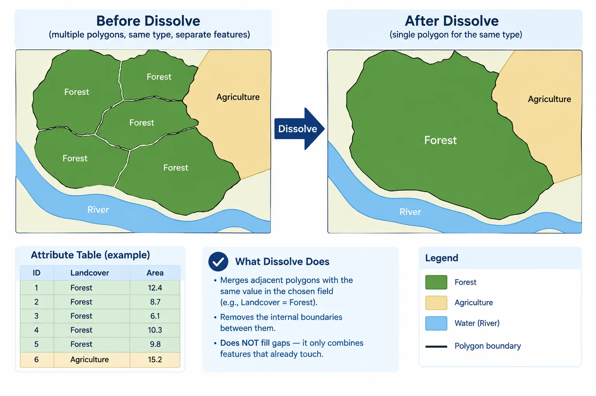

## Introduction

::: {style="text-align: justify;"}
Three of our four suitability factors already exist: slope and aspect, from [**Session 05**](session-05-slope-aspect.qmd), and land cover, from the NDVI layer in [**Session 04**](session-04-ndvi.qmd). The fourth, access to infrastructure, is the only one that starts and mostly stays a vector problem, rather than a raster one from the beginning. `road.gpkg` and `power.gpkg` are lines, not grids, and the question we actually care about, "how close is this pixel to a road or a power line", only becomes a raster question at the very last step of this session.
:::

::: {style="text-align: justify;"}
This is also the session where we go properly deeper into `geopandas` than [**Session 02**](session-02-vector-data.qmd) did. Reading, plotting, and checking CRS, what we did there, is the minimum needed to look at vector data. Combining and reshaping it, dissolving features by an attribute, joining two datasets by their spatial relationship rather than a shared column, and buffering, is what real vector analysis looks like, and it is the toolbox this session adds.
:::

## Setting Up

```{python}
import geopandas as gpd
import matplotlib.pyplot as plt
from pathlib import Path

Path("data/outputs").mkdir(parents=True, exist_ok=True)

boundary = gpd.read_file("data/Desierto_de_Tabernas.gpkg")
roads = gpd.read_file("data/road.gpkg")
power_points = gpd.read_file("data/power.gpkg", layer="power_point")
power_lines = gpd.read_file("data/power.gpkg", layer="power_line")

print("Boundary CRS:", boundary.crs)
print("Roads CRS:", roads.crs)
print("Power lines CRS:", power_lines.crs)
```

::: {.callout-note style="text-align: justify;"}
## Note: this is the same data from [**Session 02**](session-02-vector-data.qmd)
`roads` carries a `highway` column describing the road type, along with the usual columns `OSMnx` attaches, such as `osmid` and `length`. `power_lines` carries a `power` column, with values such as `line` and `minor_line`. `boundary` is in `EPSG:3857`, a projected, meters-based CRS, while `roads` and `power_lines`, freshly built from OpenStreetMap, are in `EPSG:4326`, geographic, degrees-based. This mismatch is exactly what we found and fixed in [**Session 02**](session-02-vector-data.qmd), and we will need to fix it again here, deliberately, more than once.
:::

## Dissolve: Merging Features by Attribute

::: {style="text-align: justify;"}
`road.gpkg` stores every road as a separate segment, since that is how OpenStreetMap represents a network: one row per edge between two intersections, not one row per named road. For some questions this is exactly what we want. For others, such as "how much total primary road exists in this area", it is the wrong shape, since a single primary road might be split across dozens of rows. `.dissolve()` solves this by merging every row that shares the same value in a chosen column into a single row, combining their geometries into one.
:::

```{python}
roads_by_type = roads.dissolve(by="highway")
print("Rows before dissolve:", len(roads))
print("Rows after dissolve:", len(roads_by_type))
roads_by_type.head()
```

::: {.callout-important style="text-align: justify;"}
## Note: dissolve versus a plain union
`.dissolve()` is attribute-aware: it groups rows by a column first, then merges geometries within each group, the same mental model as `pandas`'s `.groupby()` combined with a spatial merge. A plain `unary_union`, which we use later in this session, ignores attributes entirely and merges every geometry into one, with no grouping at all. Use `dissolve` when the result still needs to distinguish categories, and `unary_union` when it does not.
:::

::: {style="margin-top: 30px; margin-bottom: 45px; text-align: center;"}
{fig-alt="a simple before and after diagram showing several separate line segments of the same road type on the left merging into a single continuous line on the right, illustrating the dissolve operation" width="100%"}
:::

::: {style="text-align: center; margin-top: -25px; margin-bottom: 50px; font-size: 0.85em; opacity: 0.65;"}
*Image generated with GPT Image 2.5.*
:::

### Measuring Real Length by Road Type

::: {style="text-align: justify;"}
`roads` is in `EPSG:4326`, so, exactly as flagged in [**Session 02**](session-02-vector-data.qmd) and again in [**Session 03**](session-03-raster-metadata-crs.qmd), calling `.length` directly on it returns degrees, not meters. We reproject to a projected CRS first, `EPSG:32629`, the UTM zone that covers our study area, before measuring anything.
:::

```{python}
roads_utm = roads.to_crs("EPSG:32629")
roads_utm["length_km"] = roads_utm.length / 1000

length_by_type = roads_utm.groupby("highway")["length_km"].sum().sort_values(ascending=False)
print(length_by_type)
```

```{python}
fig, ax = plt.subplots(figsize=(9, 5))
length_by_type.plot(kind="bar", ax=ax, color="steelblue")
ax.set_ylabel("Total length (km)")
ax.set_xlabel("Road type (highway)")
ax.set_title("Total Road Length by Type")
plt.tight_layout()
plt.show()
```

::: {.callout-tip style="text-align: justify;"}
## Note: groupby versus dissolve
`.groupby("highway")["length_km"].sum()` and `roads_by_type = roads.dissolve(by="highway")` are solving related but different problems. `groupby` here only aggregates the numbers, it throws the geometry away and returns a plain summary. `dissolve` keeps the geometry, merging it into one shape per group, which is what we need whenever the merged shape itself, not just a total, is the thing we want next.
:::

<details>
<summary>Exercise 1: Dissolve the power lines</summary>

::: {style="text-align: justify;"}
Dissolve `power_lines` by its `power` column, then reproject the result to `EPSG:32629` and print the total length in kilometers for each value of `power`.
:::

<details>
<summary>Solution</summary>

```{python}
power_by_type = power_lines.dissolve(by="power")
power_by_type_utm = power_by_type.to_crs("EPSG:32629")
power_by_type_utm["length_km"] = power_by_type_utm.length / 1000

print(power_by_type_utm["length_km"])
```

</details>
</details>

## Spatial Join: Matching Features by Location, Not by Column

::: {style="text-align: justify;"}
An ordinary `pandas` join matches rows using a shared column, such as an ID. A spatial join matches rows using a geometric relationship instead, such as "this point falls inside this polygon", with no shared column required at all. `gpd.sjoin()` is the tool for this, and it needs a `predicate` argument telling it exactly what relationship counts as a match: `"within"`, `"intersects"`, `"contains"`, and a handful of others.
:::

```{python}
boundary_wgs84 = boundary.to_crs(power_points.crs)

points_with_boundary = gpd.sjoin(power_points, boundary_wgs84, predicate="within", how="left")

inside_count = points_with_boundary["index_right"].notna().sum()
outside_count = points_with_boundary["index_right"].isna().sum()

print("Power points inside boundary:", inside_count)
print("Power points outside boundary:", outside_count)
```

::: {.callout-warning style="text-align: justify;"}
## Note: reproject before joining, not after
`sjoin` compares geometries directly, so both GeoDataFrames must already share the same CRS before the join runs, exactly like the CRS check we have run before every overlay since [**Session 01**](session-01-intro-loading-data.qmd). We reprojected `boundary` to match `power_points` first, rather than the other way around, following the same rule from [**Session 01**](session-01-intro-loading-data.qmd): reproject the smaller, simpler vector layer rather than an expensive raster, and here, between two vector layers, we reproject whichever one is more convenient, as long as it happens before the join.
:::

```{python}
fig, ax = plt.subplots(figsize=(6, 6))
labels = ["Inside boundary", "Outside boundary"]
counts = [inside_count, outside_count]
ax.pie(counts, labels=labels, autopct="%1.1f%%", colors=["darkorange", "lightgray"])
ax.set_title("Power Points Relative to Study Area Boundary")
plt.show()
```

::: {style="text-align: justify;"}
`how="left"` keeps every row from `power_points`, even the ones with no match, filling `index_right` with `NaN` for those. This is usually the safer default for a spatial join: `how="inner"` would silently drop every point outside the boundary, which is sometimes exactly what you want, but not something that should happen without noticing.
:::

<details>
<summary>Exercise 2: Join with a different predicate</summary>

::: {style="text-align: justify;"}
Repeat the spatial join above using `predicate="intersects"` instead of `"within"`, and compare the resulting inside and outside counts to the ones above. For point geometries, do you expect a difference?
:::

<details>
<summary>Solution</summary>

```{python}
points_intersects = gpd.sjoin(power_points, boundary_wgs84, predicate="intersects", how="left")

inside_intersects = points_intersects["index_right"].notna().sum()
print("Inside (within):", inside_count)
print("Inside (intersects):", inside_intersects)
```

::: {style="text-align: justify;"}
For point geometries against a polygon, `"within"` and `"intersects"` almost always agree, since a point has no boundary of its own to distinguish the two cases. The difference between these predicates becomes meaningful with lines and polygons, where a feature can cross a boundary without being fully inside it.
:::

</details>
</details>

## Buffer: From a Feature to a Zone Around It

::: {style="text-align: justify;"}
A buffer expands a geometry outward by a fixed distance in every direction, turning a line or a point into a polygon representing "everywhere within this distance of the original feature". This is exactly the tool the access factor needs: a pixel counts as accessible if it falls inside a 1000 meter buffer around any road or power line.
:::

```{python}
roads_utm = roads.to_crs("EPSG:32629")
power_lines_utm = power_lines.to_crs("EPSG:32629")

road_buffer = roads_utm.buffer(1000)
power_buffer = power_lines_utm.buffer(1000)

print("Road buffer area (sq km):", road_buffer.area.sum() / 1_000_000)
print("Power buffer area (sq km):", power_buffer.area.sum() / 1_000_000)
```

::: {.callout-important style="text-align: justify;"}
## Note: buffer distance is only meaningful in a projected CRS
`.buffer(1000)` interprets `1000` in whatever unit the GeoDataFrame's current CRS uses. Called on `roads` directly, still in `EPSG:4326`, this would buffer by 1000 degrees, an area covering most of the planet, not 1000 meters. This is the same mistake flagged with `.length` and `.area` back in [**Session 02**](session-02-vector-data.qmd), and it is exactly why both layers were reprojected to `EPSG:32629`, a meters-based UTM zone, before buffering.
:::

### Combining the Buffers

::: {style="text-align: justify;"}
`road_buffer` and `power_buffer` are each a `GeoSeries` with one buffered polygon per original feature. We now want a single combined shape representing "accessible from something", with no distinction between road access and power access, and with all the individual overlapping buffer polygons merged into one. `unary_union` does exactly this, ignoring attributes entirely, unlike the attribute-aware `dissolve` used earlier in this session.
:::

```{python}
import geopandas as gpd

combined_buffers = gpd.GeoSeries(list(road_buffer) + list(power_buffer), crs="EPSG:32629")
access_zone = combined_buffers.unary_union

print(type(access_zone))
```

```{python}
fig, ax = plt.subplots(figsize=(8, 8))
boundary_utm = boundary.to_crs("EPSG:32629")

gpd.GeoSeries([access_zone], crs="EPSG:32629").plot(ax=ax, color="moccasin", alpha=0.6)
roads_utm.plot(ax=ax, color="dimgray", linewidth=0.7)
power_lines_utm.plot(ax=ax, color="darkorange", linewidth=1)
boundary_utm.boundary.plot(ax=ax, edgecolor="black", linewidth=1.5)
ax.set_title("1000m Access Buffer Around Roads and Power Lines")
plt.show()
```

<details>
<summary>Exercise 3: A shorter buffer distance</summary>

::: {style="text-align: justify;"}
Rebuild the combined buffer using 500 meters instead of 1000, and compare the total buffered area, in square kilometers, between the two distances.
:::

<details>
<summary>Solution</summary>

```{python}
road_buffer_500 = roads_utm.buffer(500)
power_buffer_500 = power_lines_utm.buffer(500)
combined_500 = gpd.GeoSeries(list(road_buffer_500) + list(power_buffer_500), crs="EPSG:32629")
access_zone_500 = combined_500.unary_union

fig, ax = plt.subplots(figsize=(6, 5))
areas_km2 = [access_zone_500.area / 1_000_000, access_zone.area / 1_000_000]
ax.bar(["500m buffer", "1000m buffer"], areas_km2, color=["lightseagreen", "darkorange"])
ax.set_ylabel("Total accessible area (sq km)")
ax.set_title("Effect of Buffer Distance on Accessible Area")
plt.show()
```

</details>
</details>

### Quick quiz

<details>
<summary>Question 1</summary>

::: {style="text-align: justify;"}
Why does `unary_union`, rather than `dissolve`, get used to combine the road and power buffers into a single access zone?
:::

A. Because `dissolve` cannot be used on buffered geometries

B. Because the access zone should not distinguish between road access and power access, so no attribute grouping is needed

C. Because `unary_union` is faster in every case

D. Because the buffers are in different CRS

<details>
<summary>Answer</summary>
B. `dissolve` groups by an attribute column before merging, which is useful when the result still needs categories. Here we deliberately want one undifferentiated zone, "accessible or not", with no distinction kept between the source layers, which is exactly what a plain `unary_union` gives us.
</details>
</details>

## From Vector to Raster: Rasterizing the Access Zone

::: {style="text-align: justify;"}
Every other suitability factor is already a raster, aligned to the same grid as `dem.tif`. The access zone, so far, is a single `shapely` polygon with no pixels at all. `rasterio.features.rasterize()` closes this gap: given a geometry and a reference grid, defined by a shape and a transform, exactly the metadata we studied in [**Session 03**](session-03-raster-metadata-crs.qmd), it produces a new array marking which pixels fall inside that geometry.
:::

```{python}
import rasterio
import rasterio.features
import numpy as np

with rasterio.open("data/dem.tif") as src:
    reference_shape = (src.height, src.width)
    reference_transform = src.transform
    reference_crs = src.crs
    reference_profile = src.profile
```

::: {.callout-warning style="text-align: justify;"}
## Note: the geometry must match the reference raster's CRS
`rasterize()` has no awareness of CRS at all, it works purely in the reference grid's own coordinates. `access_zone` is currently in `EPSG:32629`, from the buffering step above, while `dem.tif` is in `EPSG:4326`, as noted since [**Session 05**](session-05-slope-aspect.qmd). The geometry has to be reprojected to match the raster before rasterizing, or every pixel will be marked incorrectly.
:::

```{python}
from pyproj import CRS
from shapely.ops import transform as shapely_transform
from pyproj import Transformer

transformer = Transformer.from_crs("EPSG:32629", reference_crs, always_xy=True)
access_zone_dem_crs = shapely_transform(transformer.transform, access_zone)

access_raster = rasterio.features.rasterize(
    [(access_zone_dem_crs, 1)],
    out_shape=reference_shape,
    transform=reference_transform,
    fill=0,
    dtype="uint8",
)

print("Access raster shape:", access_raster.shape)
print("Accessible pixels:", np.sum(access_raster == 1))
```

```{python}
accessible_percentage = (np.sum(access_raster == 1) / access_raster.size) * 100

fig, ax = plt.subplots(figsize=(7, 7))
ax.imshow(access_raster, cmap="Greens")
ax.set_title(f"Access Mask (within 1000m of road or power), {accessible_percentage:.2f}% of pixels")
plt.show()
```

::: {style="text-align: justify;"}
This is the same style of percentage summary used for the NDWI water mask in [**Session 04**](session-04-ndvi.qmd) and the gentle slope and south facing masks in [**Session 05**](session-05-slope-aspect.qmd), and deliberately so: every one of the project's four suitability inputs ends this course's early sessions the same way, as a mask or continuous layer with a printed percentage, ready to be combined once every layer finally shares one grid, in [**Session 07**](session-07-reprojection.qmd).
:::

## Saving the Result

```{python}
output_profile = reference_profile.copy()
output_profile.update({"dtype": "uint8", "count": 1, "nodata": None})

with rasterio.open("data/outputs/access.tif", "w", **output_profile) as dst:
    dst.write(access_raster, 1)

print("Saved access.tif to data/outputs/")
```

<details>
<summary>Exercise 4: Rasterize the 500m buffer</summary>

::: {style="text-align: justify;"}
Using `access_zone_500` from Exercise 3, reproject it to the DEM's CRS and rasterize it against the same reference grid. Compare the accessible percentage against the 1000m version above with a bar chart.
:::

<details>
<summary>Solution</summary>

```{python}
access_zone_500_dem_crs = shapely_transform(transformer.transform, access_zone_500)

access_raster_500 = rasterio.features.rasterize(
    [(access_zone_500_dem_crs, 1)],
    out_shape=reference_shape,
    transform=reference_transform,
    fill=0,
    dtype="uint8",
)

percentage_500 = (np.sum(access_raster_500 == 1) / access_raster_500.size) * 100

fig, ax = plt.subplots(figsize=(6, 5))
ax.bar(["500m buffer", "1000m buffer"], [percentage_500, accessible_percentage], color=["lightseagreen", "darkorange"])
ax.set_ylabel("Accessible pixels (%)")
ax.set_title("Effect of Buffer Distance on Accessible Area")
plt.show()
```

</details>
</details>

### Quick quiz

<details>
<summary>Question 2</summary>

::: {style="text-align: justify;"}
Why does `rasterize()` need a reference raster's shape and transform, rather than just the geometry itself?
:::

A. Because `rasterize()` cannot work with polygons, only points

B. Because the geometry has no pixel grid of its own; the reference grid supplies the resolution and extent that turns it into pixels

C. Because the geometry must already be in raster format

D. Because `rasterize()` always produces a raster the same size as the geometry's bounding box

<details>
<summary>Answer</summary>
B. A vector geometry is defined by coordinates, not pixels. `rasterize()` needs to be told exactly what grid, what resolution, what extent, and what alignment, to stamp that geometry onto, which is exactly the `out_shape` and `transform` supplied from the reference raster.
</details>
</details>

## Building `spatial_analysis.py`

::: {style="text-align: justify;"}
This session's module collects the dissolve, join, buffer, and rasterize steps above into reusable functions, saved into `modules/spatial_analysis.py`.
:::

```python
# modules/spatial_analysis.py

import geopandas as gpd
import rasterio.features
from pyproj import Transformer
from shapely.ops import transform as shapely_transform


def dissolve_by_type(gdf, column):
    """Merge features sharing the same value in a given column into one geometry per group."""
    return gdf.dissolve(by=column)


def join_within_boundary(gdf, boundary):
    """Return only the features of gdf that fall within boundary, after matching their CRS."""
    boundary_matched = boundary.to_crs(gdf.crs)
    joined = gpd.sjoin(gdf, boundary_matched, predicate="within", how="left")
    return joined[joined["index_right"].notna()]


def buffer_and_union(gdf_list, distance, projected_crs):
    """Buffer each GeoDataFrame in gdf_list by distance (in the units of projected_crs),
    then merge every resulting buffer into a single combined geometry."""
    all_buffers = []
    for gdf in gdf_list:
        gdf_projected = gdf.to_crs(projected_crs)
        all_buffers.extend(list(gdf_projected.buffer(distance)))

    combined = gpd.GeoSeries(all_buffers, crs=projected_crs)
    return combined.unary_union


def rasterize_to_reference(geometry, geometry_crs, reference_shape, reference_transform, reference_crs):
    """Rasterize a single geometry onto a reference raster's grid, reprojecting it first if needed."""
    if geometry_crs != reference_crs:
        transformer = Transformer.from_crs(geometry_crs, reference_crs, always_xy=True)
        geometry = shapely_transform(transformer.transform, geometry)

    return rasterio.features.rasterize(
        [(geometry, 1)],
        out_shape=reference_shape,
        transform=reference_transform,
        fill=0,
        dtype="uint8",
    )
```

::: {.callout-tip style="text-align: justify;"}
Following the same split used in every module so far, `dissolve_by_type` and `join_within_boundary` work directly on GeoDataFrames with no file access, while `rasterize_to_reference` is the one function here that bridges vector and raster, exactly the boundary this session itself walked across.
:::

## Summary

::: {style="text-align: justify;"}
This session pushed our `geopandas` skills well past reading and plotting: `.dissolve()` merged road and power features by attribute, `gpd.sjoin()` matched features by spatial relationship rather than a shared column, and `.buffer()` turned lines and points into zones of influence, all while carefully managing the CRS reprojections that [**Session 01**](session-01-intro-loading-data.qmd) and [**Session 02**](session-02-vector-data.qmd) already warned us about. We combined road and power buffers into a single access zone with `unary_union`, and closed the loop back to raster with `rasterio.features.rasterize()`, producing and saving `access.tif`, our fourth and final suitability factor. We also built `modules/spatial_analysis.py`. Every factor the project needs now exists as a raster, but each one has its own shape, resolution, and CRS. [**Session 07**](session-07-reprojection.qmd) is where we force all four onto one common grid, so they can finally be combined.
:::