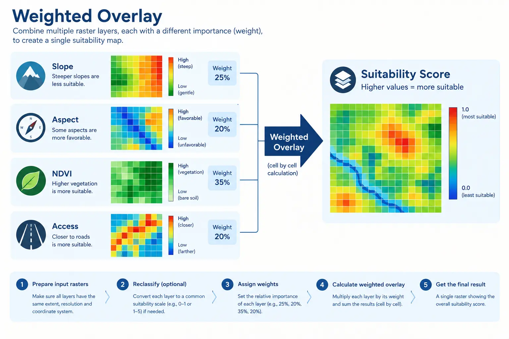

## Introduction

::: {style="text-align: justify;"}
[**Session 07**](session-07-reprojection.qmd) ended with four rasters that finally share the exact same shape, transform, and CRS: slope, aspect, NDVI, and access. This session is the one the entire course has been building toward, combining those four layers into a single suitability score for every pixel, and turning that score into a map someone could actually use to decide where a solar installation makes sense.
:::

::: {style="text-align: justify;"}
This kind of analysis, combining several raster layers, each describing one relevant factor, into one overall score, is called a **weighted overlay**. It is one of the oldest and most common techniques in GIS, used for far more than solar siting: choosing a site for a new road, a hospital, a landfill, or a nature reserve all follow the same basic pattern. The specific factors change, but the underlying idea does not: decide what matters, decide how much each thing matters relative to the others, and combine them consistently across every pixel at once.
:::

## Why Raw Values Cannot Simply Be Added

::: {style="text-align: justify;"}
It is worth pausing on why this session needs a normalization step at all, before jumping to code. Slope is measured in degrees, roughly 0 to 90. NDVI is a ratio between -1 and 1. Access is already 0 or 1. If we tried to add these three numbers directly, a single degree of slope would completely swamp the entire range of NDVI, not because slope actually matters more, but purely because its numbers happen to be bigger. Before any two measurements can be meaningfully combined, they need to be expressed on the same scale, in a way that also reflects which direction is "good" for each one.
:::

::: {style="margin-top: 30px; margin-bottom: 45px; text-align: center;"}
{fig-alt="a simple diagram showing four separate raster grids (slope, aspect, ndvi, access) each with a small icon, stacked and combined by an arrow into a single output grid labeled suitability score, illustrating the weighted overlay concept" width="100%"}
:::

::: {style="text-align: center; margin-top: -25px; margin-bottom: 50px; font-size: 0.85em; opacity: 0.65;"}
*Image generated with GPT Image 2.5.*
:::

::: {style="text-align: justify;"}
The convention this session uses, and the standard convention in weighted overlay generally, is to rescale every factor onto the same 0 to 1 range, where 0 always means "worst for this purpose" and 1 always means "best for this purpose", regardless of what the original units were. This step is called **normalization**. Once every factor speaks the same language, 0 to 1, combining them with simple arithmetic finally becomes meaningful.
:::

## Loading the Aligned Layers

```{python}
import rasterio
import numpy as np

aligned_paths = {
    "slope": "data/outputs/aligned/slope_aligned.tif",
    "aspect": "data/outputs/aligned/aspect_aligned.tif",
    "ndvi": "data/outputs/aligned/ndvi_aligned.tif",
    "access": "data/outputs/aligned/access_aligned.tif",
}

layers = {}
reference_profile = None

for name, path in aligned_paths.items():
    with rasterio.open(path) as src:
        layers[name] = src.read(1).astype("float32")
        if reference_profile is None:
            reference_profile = src.profile

print({name: array.shape for name, array in layers.items()})
```

::: {.callout-note style="text-align: justify;"}
## Note: relying on [**Session 07**](session-07-reprojection.qmd)
Nothing in this section checks alignment by hand, since `check_alignment` from `modules/reprojector.py`, built in [**Session 07**](session-07-reprojection.qmd), already exists specifically to be called here first, before any of this session's own math runs. It is good practice to actually call it, rather than only trusting that [**Session 07**](session-07-reprojection.qmd) worked.
:::

```{python}
import sys
sys.path.append("modules")
from reprojector import check_alignment

check_alignment(layers)
```

## Normalizing Slope

::: {style="text-align: justify;"}
Gentle slopes are good for solar installation, steep slopes are not, so slope needs an inverted normalization: low slope should map close to 1, and high slope should map close to 0. A simple, common approach is min-max normalization, rescaling the actual range of values in the data to sit between 0 and 1, then flipping it.
:::

```{python}
def normalize_slope(slope, max_slope=45):
    """Normalize slope so 0 degrees scores 1 (best) and max_slope or more scores 0 (worst)."""
    clipped = np.clip(slope, 0, max_slope)
    normalized = 1 - (clipped / max_slope)
    return normalized


slope_score = normalize_slope(layers["slope"])
print("Slope score range:", slope_score.min(), "to", slope_score.max())
```

::: {.callout-tip style="text-align: justify;"}
## Note: why cap at 45 degrees, rather than the data's own maximum
Min-max normalization is often written using the data's own minimum and maximum, but that has a subtle problem here: if this DEM happens to contain one unusually steep outlier pixel, every other, much gentler slope would get rescaled relative to that single extreme value, compressing all the meaningful differences into a narrow band near 1. Choosing a fixed, sensible cap, 45 degrees is already far steeper than anything reasonable for solar installation, avoids letting one outlier pixel distort the scoring for every other pixel. `np.clip` ensures any slope beyond that cap is simply treated as equally bad, at exactly 0, rather than going negative.
:::

## Normalizing Aspect

::: {style="text-align: justify;"}
Aspect needs more care than a straight min-max rescale, for the same reason flagged back in [**Session 05**](session-05-slope-aspect.qmd): it is a circular quantity. A south-facing slope, around 180 degrees, is ideal. As aspect moves away from 180 in either direction, east through west or west through east, suitability should fall off symmetrically, until due north, 0 or 360 degrees, is the worst possible aspect. A plain `aspect / 360` would incorrectly treat 359 degrees as almost the best score, when it is actually almost due north, one of the worst.
:::

```{python}
def normalize_aspect(aspect):
    """Score aspect by closeness to south (180 degrees). Flat pixels (-1) score 0."""
    distance_from_south = np.abs(aspect - 180)
    distance_from_south = np.minimum(distance_from_south, 360 - distance_from_south)
    score = 1 - (distance_from_south / 180)

    score = np.where(aspect == -1, 0, score)
    return score


aspect_score = normalize_aspect(layers["aspect"])
print("Aspect score range:", aspect_score.min(), "to", aspect_score.max())
```

::: {style="text-align: justify;"}
`np.minimum(distance_from_south, 360 - distance_from_south)` is the same wraparound logic used any time a circular quantity, aspect, wind direction, compass bearing, is compared to a fixed target: it takes the shorter of the two possible paths around the circle, so 359 degrees and 1 degree both correctly end up extremely close to 0 degrees, rather than at opposite ends of a straight numeric scale.
:::

::: {.callout-warning style="text-align: justify;"}
## Note: flat pixels do not simply score badly, they need their own rule
Recall from [**Session 05**](session-05-slope-aspect.qmd) that flat ground has no defined aspect at all, and was marked with the sentinel value `-1`, not a real compass direction. Feeding `-1` into the distance formula above would produce a nonsensical result, since `-1` is not a real aspect. We explicitly override every flat pixel to a fixed score, `0`, after the main formula runs, rather than letting the formula guess for a case it was never designed to handle. A flat pixel that also happens to be gently sloped is still a candidate site, so a score of exactly 0 for aspect is a deliberate simplification for this course, not a claim that flat ground is truly worthless; a more advanced version of this project might score flat aspect as neutral instead of worst.
:::

## Normalizing NDVI

::: {style="text-align: justify;"}
Low NDVI, bare or scrubby ground, is preferable for this project, exactly as established back in [**Session 04**](session-04-ndvi.qmd), so NDVI also needs an inverted normalization, the same shape as slope's, but over NDVI's own natural range.
:::

```{python}
def normalize_ndvi(ndvi):
    """Normalize NDVI so low vegetation scores 1 (best) and high vegetation scores 0 (worst)."""
    clipped = np.clip(ndvi, -1, 1)
    normalized = 1 - ((clipped + 1) / 2)
    return normalized


ndvi_score = normalize_ndvi(layers["ndvi"])
print("NDVI score range:", ndvi_score.min(), "to", ndvi_score.max())
```

::: {style="text-align: justify;"}
`(clipped + 1) / 2` first rescales NDVI's own -1 to 1 range onto a plain 0 to 1 range, the ordinary min-max step, since NDVI's mathematical range is always exactly -1 to 1 regardless of the specific image, unlike slope, which has no fixed natural maximum. `1 -` then flips that scale, since high NDVI, dense vegetation, should score low suitability, not high.
:::

## Access Needs No Normalization

::: {style="text-align: justify;"}
`access.tif` already stores exactly 0 or 1, with 1 already meaning "good", accessible, so no rescaling is needed at all. It is included here only to make explicit that not every layer requires the same treatment, and that checking what a layer already represents comes before deciding how, or whether, to transform it.
:::

```{python}
access_score = layers["access"]
print("Access score unique values:", np.unique(access_score))
```

## Visualizing All Four Normalized Scores

::: {style="text-align: justify;"}
Before combining anything, it is worth looking at all four scores side by side, now that they finally share not just a grid, but a scale. Every one of these four maps should visually range from 0, shown pale or dark depending on the colormap, to 1.
:::

```{python}
import matplotlib.pyplot as plt

scores = {"Slope": slope_score, "Aspect": aspect_score, "NDVI": ndvi_score, "Access": access_score}

fig, axes = plt.subplots(2, 2, figsize=(12, 10))
for ax, (name, array) in zip(axes.flat, scores.items()):
    im = ax.imshow(array, cmap="RdYlGn", vmin=0, vmax=1)
    ax.set_title(f"{name} Score (normalized)")
    plt.colorbar(im, ax=ax, shrink=0.7)

plt.tight_layout()
plt.show()
```

## Combining the Scores: The Weighted Sum

::: {style="text-align: justify;"}
A **weight** is simply a number representing how much a factor should count relative to the others, and the weights across all factors are chosen to add up to 1, so the final combined score stays within the same 0 to 1 range as each individual input. This project's default weights, established at the start of the course, are slope 0.3, aspect 0.2, NDVI 0.3, and access 0.2, reflecting that terrain, slope and land cover, matters somewhat more for this particular project than proximity to existing infrastructure, though this is a modeling choice, not a fact about solar siting in general, which is exactly why it becomes this session's main exercise to change.
:::

```{python}
weights = {
    "slope": 0.3,
    "aspect": 0.2,
    "ndvi": 0.3,
    "access": 0.2,
}

print("Weights sum to:", sum(weights.values()))
```

```{python}
def calculate_final_score(slope_score, aspect_score, ndvi_score, access_score, weights):
    """Combine four normalized 0-1 layers into one weighted score, scaled to 0-100."""
    combined = (
        slope_score * weights["slope"]
        + aspect_score * weights["aspect"]
        + ndvi_score * weights["ndvi"]
        + access_score * weights["access"]
    )
    return combined * 100


suitability_score = calculate_final_score(slope_score, aspect_score, ndvi_score, access_score, weights)
print("Suitability score range:", suitability_score.min(), "to", suitability_score.max())
```

::: {.callout-important style="text-align: justify;"}
## Note: a weighted sum is not the only way to combine factors
This project uses a **weighted linear sum**, the most common and easiest to explain approach: each factor contributes independently, in proportion to its weight, and a very bad score in one factor can still be outweighed by very good scores in the others. Real GIS suitability models sometimes use stricter alternatives instead, such as a weighted product, where every factor is multiplied together rather than added, so a score of 0 in any single factor forces the whole result to 0 regardless of the others. We use the additive version here because it is simpler to reason about while learning the technique, not because it is the only correct choice for every project.
:::

## Applying the Water Exclusion Mask

::: {style="text-align: justify;"}
The NDWI water mask, built and inspected but deliberately never applied back in [**Session 04**](session-04-ndvi.qmd), finally gets used here. A pixel sitting in water is not simply penalized for it, exactly as that session explained, it should be removed from consideration entirely, regardless of how favorably every other factor scored it. We rebuild the mask here, since it was not one of the four factor layers carried through [**Session 07**](session-07-reprojection.qmd)'s alignment, and apply it directly to the final score.
:::

```{python}
with rasterio.open("data/sentinel.tif") as src:
    green = src.read(2).astype("float32")
    nir = src.read(4).astype("float32")

with np.errstate(divide="ignore", invalid="ignore"):
    ndwi = np.where((green + nir) != 0, (green - nir) / (green + nir), 0)

water_mask = ndwi > 0
print("Water pixels in original grid:", np.sum(water_mask))
```

::: {.callout-warning style="text-align: justify;"}
## Note: the water mask needs aligning too
`ndwi` above was calculated directly from `sentinel.tif`, still in its original grid from [**Session 04**](session-04-ndvi.qmd), not the aligned grid this session has been using since. Applying it directly to `suitability_score` would silently reintroduce the exact misalignment problem [**Session 07**](session-07-reprojection.qmd) exists to prevent. In a full project, this mask would be run through the same `resample_to_reference` step from `modules/reprojector.py` before use. For this session, since building the full mask is a repeat of [**Session 04**](session-04-ndvi.qmd)'s own steps, we take the shortcut of resampling only the boolean mask itself with nearest-neighbor resampling, the correct method for categorical data, exactly as decided in [**Session 07**](session-07-reprojection.qmd).
:::

```{python}
from rasterio.warp import reproject, Resampling

with rasterio.open("data/sentinel.tif") as src:
    water_mask_uint8 = water_mask.astype("uint8")
    aligned_water_mask = np.zeros(suitability_score.shape, dtype="uint8")

    reproject(
        source=water_mask_uint8,
        destination=aligned_water_mask,
        src_transform=src.transform,
        src_crs=src.crs,
        dst_transform=reference_profile["transform"],
        dst_crs=reference_profile["crs"],
        resampling=Resampling.nearest,
    )

suitability_score = np.where(aligned_water_mask == 1, 0, suitability_score)
print("Suitability score range after masking water:", suitability_score.min(), "to", suitability_score.max())
```

## Classifying the Final Map

::: {style="text-align: justify;"}
A continuous 0 to 100 score is precise, but a decision maker usually wants a simpler answer: is this location suitable or not. We split the continuous score into three classes using fixed thresholds, following the project's original plan: below 40 is unsuitable, 40 to 70 is moderate, and above 70 is suitable.
:::

```{python}
def classify_suitability(score, low_threshold=40, high_threshold=70):
    """Classify a continuous suitability score into 3 classes: 0=unsuitable, 1=moderate, 2=suitable."""
    classified = np.zeros_like(score, dtype="uint8")
    classified[(score >= low_threshold) & (score < high_threshold)] = 1
    classified[score >= high_threshold] = 2
    return classified


suitability_class = classify_suitability(suitability_score)
class_labels = {0: "Unsuitable", 1: "Moderate", 2: "Suitable"}
```

::: {.callout-tip style="text-align: justify;"}
## Note: `np.zeros_like`
`np.zeros_like(score, dtype="uint8")` creates a new array with the same shape as `score`, but filled with 0 and stored as an 8-bit unsigned integer, appropriate for a layer that only ever needs to hold the values 0, 1, or 2. This is the same pattern as `np.zeros()` from Session 00, except the shape is copied from an existing array rather than typed out by hand, which matters here since we do not want to risk a typo producing a shape that quietly does not match `suitability_score`.
:::

## Visualizing the Final Result

```{python}
fig, axes = plt.subplots(1, 2, figsize=(14, 7))

score_im = axes[0].imshow(suitability_score, cmap="RdYlGn", vmin=0, vmax=100)
axes[0].set_title("Suitability Score (0-100)")
plt.colorbar(score_im, ax=axes[0], label="Score", shrink=0.7)

from matplotlib.colors import ListedColormap

class_cmap = ListedColormap(["firebrick", "khaki", "forestgreen"])
class_im = axes[1].imshow(suitability_class, cmap=class_cmap, vmin=0, vmax=2)
axes[1].set_title("Suitability Class")
colorbar = plt.colorbar(class_im, ax=axes[1], ticks=[0, 1, 2], shrink=0.7)
colorbar.ax.set_yticklabels(["Unsuitable", "Moderate", "Suitable"])

plt.tight_layout()
plt.show()
```

## How Much Area Falls Into Each Class

::: {style="text-align: justify;"}
A map communicates location, but a decision maker often wants a single summary number first: how much of the study area is actually usable. We count pixels per class and convert that count into an approximate area, using the pixel resolution carried in `reference_profile`.
:::

```{python}
pixel_area_m2 = abs(reference_profile["transform"].a * reference_profile["transform"].e)

class_counts = {label: np.sum(suitability_class == value) for value, label in class_labels.items()}
class_area_km2 = {label: (count * pixel_area_m2) / 1_000_000 for label, count in class_counts.items()}

for label, area in class_area_km2.items():
    print(f"{label}: {area:.2f} sq km")
```

```{python}
fig, ax = plt.subplots(figsize=(7, 5))
ax.bar(class_area_km2.keys(), class_area_km2.values(), color=["firebrick", "khaki", "forestgreen"])
ax.set_ylabel("Area (sq km)")
ax.set_title("Suitability Class Area Distribution")
plt.show()
```

<details>
<summary>Exercise 1: Change the weights</summary>

::: {style="text-align: justify;"}
The default weights treat slope and NDVI as somewhat more important than aspect and access. Recalculate the suitability score using equal weights instead, 0.25 for every factor, and compare the resulting class area distribution against the default weights, using a grouped bar chart.
:::

<details>
<summary>Solution</summary>

```{python}
equal_weights = {"slope": 0.25, "aspect": 0.25, "ndvi": 0.25, "access": 0.25}

suitability_equal = calculate_final_score(slope_score, aspect_score, ndvi_score, access_score, equal_weights)
suitability_equal = np.where(aligned_water_mask == 1, 0, suitability_equal)
class_equal = classify_suitability(suitability_equal)

counts_equal = {label: np.sum(class_equal == value) for value, label in class_labels.items()}
area_equal = {label: (count * pixel_area_m2) / 1_000_000 for label, count in counts_equal.items()}

import numpy as np

x = np.arange(len(class_labels))
width = 0.35

fig, ax = plt.subplots(figsize=(8, 5))
ax.bar(x - width / 2, class_area_km2.values(), width, label="Default weights", color="steelblue")
ax.bar(x + width / 2, area_equal.values(), width, label="Equal weights", color="darkorange")
ax.set_xticks(x)
ax.set_xticklabels(class_area_km2.keys())
ax.set_ylabel("Area (sq km)")
ax.set_title("Default vs Equal Weights")
ax.legend()
plt.show()
```

</details>
</details>

<details>
<summary>Exercise 2: A stricter suitable threshold</summary>

::: {style="text-align: justify;"}
Reclassify `suitability_score` using a stricter threshold for the suitable class, 80 instead of 70, keeping the unsuitable threshold at 40. Compare the resulting suitable area, in square kilometers, against the original threshold.
:::

<details>
<summary>Solution</summary>

```{python}
strict_class = classify_suitability(suitability_score, low_threshold=40, high_threshold=80)

strict_suitable_km2 = (np.sum(strict_class == 2) * pixel_area_m2) / 1_000_000
original_suitable_km2 = class_area_km2["Suitable"]

print(f"Suitable area (threshold 70): {original_suitable_km2:.2f} sq km")
print(f"Suitable area (threshold 80): {strict_suitable_km2:.2f} sq km")
```

</details>
</details>

### Quick quiz

<details>
<summary>Question 1</summary>

::: {style="text-align: justify;"}
Why must every factor be normalized to the same 0-1 range before applying weights, rather than combining the raw slope, aspect, NDVI, and access values directly?
:::

A. Because `numpy` cannot add arrays with different data types

B. Because each factor's raw values use different units and ranges, so a weight applied to unnormalized numbers would not actually reflect the intended importance of each factor

C. Because normalization is required for `rasterio` to save a file

D. Because only integer arrays can be combined with weights

<details>
<summary>Answer</summary>
B. A weight is only meaningful relative to a shared scale. Applying a weight of 0.3 to slope, measured in tens of degrees, and 0.3 to NDVI, measured between -1 and 1, would not give them equal influence at all, since their raw numbers are wildly different sizes to begin with.
</details>
</details>

<details>
<summary>Question 2</summary>

::: {style="text-align: justify;"}
Why is the water mask applied after the weighted sum, by forcing masked pixels to 0, rather than built into `calculate_final_score` as a fifth weighted factor?
:::

A. Because NDWI cannot be normalized to a 0-1 range

B. Because a weighted factor only ever nudges a score up or down, while water needs to remove a pixel from consideration entirely, exactly the distinction made back in [**Session 04**](session-04-ndvi.qmd)

C. Because `numpy` does not support more than four arrays in a weighted sum

D. Because water pixels always have the lowest NDVI value

<details>
<summary>Answer</summary>
B. This is the same reasoning introduced in [**Session 04**](session-04-ndvi.qmd)'s quiz: NDVI describes a spectrum where a partial penalty makes sense, but a water pixel is a hard exclusion, not a matter of degree. A weight, no matter how large, can always be outweighed by the other factors; an explicit mask cannot.
</details>
</details>

## Saving the Results

```{python}
from pathlib import Path

Path("data/outputs").mkdir(parents=True, exist_ok=True)

score_profile = reference_profile.copy()
score_profile.update({"dtype": "float32", "count": 1, "nodata": None})

with rasterio.open("data/outputs/suitability.tif", "w", **score_profile) as dst:
    dst.write(suitability_score.astype("float32"), 1)

class_profile = reference_profile.copy()
class_profile.update({"dtype": "uint8", "count": 1, "nodata": None})

with rasterio.open("data/outputs/suitability_class.tif", "w", **class_profile) as dst:
    dst.write(suitability_class, 1)

print("Saved suitability.tif and suitability_class.tif to data/outputs/")
```

## Building `solar_suitability.py`

```python
# modules/solar_suitability.py

import numpy as np


def normalize_slope(slope, max_slope=45):
    """Normalize slope so 0 degrees scores 1 (best) and max_slope or more scores 0 (worst)."""
    clipped = np.clip(slope, 0, max_slope)
    return 1 - (clipped / max_slope)


def normalize_aspect(aspect):
    """Score aspect by closeness to south (180 degrees). Flat pixels (-1) score 0."""
    distance_from_south = np.abs(aspect - 180)
    distance_from_south = np.minimum(distance_from_south, 360 - distance_from_south)
    score = 1 - (distance_from_south / 180)
    return np.where(aspect == -1, 0, score)


def normalize_ndvi(ndvi):
    """Normalize NDVI so low vegetation scores 1 (best) and high vegetation scores 0 (worst)."""
    clipped = np.clip(ndvi, -1, 1)
    return 1 - ((clipped + 1) / 2)


def calculate_final_score(slope_score, aspect_score, ndvi_score, access_score, weights):
    """Combine four normalized 0-1 layers into one weighted score, scaled to 0-100."""
    combined = (
        slope_score * weights["slope"]
        + aspect_score * weights["aspect"]
        + ndvi_score * weights["ndvi"]
        + access_score * weights["access"]
    )
    return combined * 100


def apply_water_mask(score, water_mask):
    """Force any pixel flagged as water to a score of 0, regardless of its other factors."""
    return np.where(water_mask == 1, 0, score)


def classify_suitability(score, low_threshold=40, high_threshold=70):
    """Classify a continuous suitability score into 3 classes: 0=unsuitable, 1=moderate, 2=suitable."""
    classified = np.zeros_like(score, dtype="uint8")
    classified[(score >= low_threshold) & (score < high_threshold)] = 1
    classified[score >= high_threshold] = 2
    return classified
```

::: {.callout-tip style="text-align: justify;"}
Every function here works on plain NumPy arrays, following the same split as every module before it: the parts of this session that actually open files, in the notebook above, stay separate from the parts that only do math, which is what makes it possible for [**Session 09**](session-09-interactive-map.qmd) to import `classify_suitability` and reuse it without needing to know anything about how `suitability.tif` was produced.
:::

## Summary

::: {style="text-align: justify;"}
This session combined everything the project has built so far into one result. We normalized slope, aspect, and NDVI onto a shared 0-1 scale, each with a rule specific to what "good" means for that factor, left access unchanged since it was already on that scale, and combined all four with a weighted sum into a single 0-100 suitability score. We applied the NDWI water mask for the first time since it was built in [**Session 04**](session-04-ndvi.qmd), turning it from an inspected layer into a real exclusion, classified the result into three usable categories, and summarized both a map and an area distribution chart. We also built `modules/solar_suitability.py`, saved `suitability.tif` and `suitability_class.tif`, and practiced changing both the weights and the classification thresholds as exercises, exactly the kind of adjustment a real siting decision would need to revisit more than once. [**Session 09**](session-09-interactive-map.qmd) takes this static result and turns it into an interactive web map with Folium.
:::