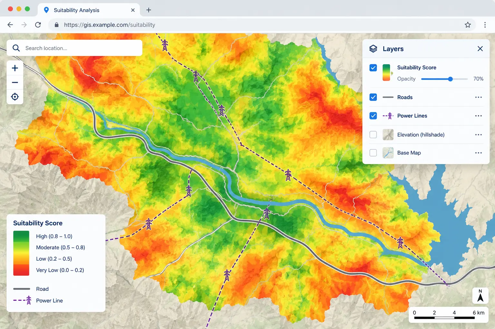

## Introduction

::: {style="text-align: justify;"}
Every output this project has produced so far, `ndvi.tif`, `slope.tif`, `access.tif`, `suitability.tif`, only exists as a file on disk, or as a `matplotlib` figure that lives and dies inside a single notebook cell. That is fine for us, sitting inside the analysis, but it is a poor way to hand a result to someone who was not in the room while it was built: a city planner, an investor, a colleague who has never opened Python. This session turns the final suitability result from [**Session 08**](session-08-suitability-model.qmd) into a single, self-contained HTML file, `solar_map.html`, that opens in any browser, can be panned and zoomed like any modern web map, and needs nothing installed to view.
:::

::: {style="text-align: justify;"}
`folium` is the tool for this. It does not draw a map itself, it generates the HTML, CSS, and JavaScript that hands the drawing job to `Leaflet.js`, the same web mapping engine behind a huge share of the interactive maps you have already seen on the internet. `geopandas`'s `.explore()`, used briefly in [**Session 02**](session-02-vector-data.qmd), is actually built on top of `folium` already; this session is where we stop using that shortcut and build a map by hand, with full control over every layer, popup, and legend.
:::

::: {margin-top: 30px; margin-bottom: 45px; text-align: center;"}
{fig-alt="a browser window showing a web map with a colored suitability overlay, road and power line layers, a legend in the corner, and a layer control panel, illustrating what this session's output will look like" width="100%"}
:::

::: {style="text-align: center; margin-top: -25px; margin-bottom: 50px; font-size: 0.85em; opacity: 0.65;"}
*Image generated with GPT Image 2.5.*
:::

## Setting Up

```{python}
import geopandas as gpd
import rasterio
import numpy as np
import folium
from pathlib import Path

Path("data/outputs").mkdir(parents=True, exist_ok=True)

boundary = gpd.read_file("data/Desierto_de_Tabernas.gpkg")
roads = gpd.read_file("data/road.gpkg")
power_points = gpd.read_file("data/power.gpkg", layer="power_point")
power_lines = gpd.read_file("data/power.gpkg", layer="power_line")
```

::: {.callout-note style="text-align: justify;"}
`suitability_class.tif`, the file we actually put on the map, was saved in [**Session 08**](session-08-suitability-model.qmd) using `reference_profile`, which came from [**Session 07**](session-07-reprojection.qmd)'s aligned grid, `EPSG:32629`. `Leaflet.js`, the engine underneath `folium`, expects every coordinate it is given in plain longitude and latitude, `EPSG:4326`. This mismatch is exactly the kind of thing [**Session 01**](session-01-intro-loading-data.qmd) through [**Session 07**](session-07-reprojection.qmd) trained us to check for automatically by now, rather than being caught off guard by it.
:::

## Reprojecting the Suitability Raster for the Web

::: {style="text-align: justify;"}
We already built exactly the function this step needs, `reproject_raster` in `modules/reprojector.py`, from [**Session 07**](session-07-reprojection.qmd). Reusing it here instead of writing the reprojection logic a second time is the entire point of having built it as a module in the first place.
:::

```{python}
import sys
sys.path.append("modules")

from reprojector import reproject_raster
from rasterio.warp import Resampling

reproject_raster(
    "data/outputs/suitability_class.tif",
    "data/outputs/suitability_class_4326.tif",
    target_crs="EPSG:4326",
    resampling=Resampling.nearest,
)
```

::: {.callout-important style="text-align: justify;"}
## Note: `nearest`, again
`suitability_class.tif` holds three discrete category values, 0, 1, 2, exactly the same kind of categorical data as `access.tif` back in [**Session 07**](session-07-reprojection.qmd). Blending two categories together with `bilinear` would invent a meaningless fourth "class" such as 0.6, so `nearest` is the only correct choice here too, for the same reason as before.
:::

## From a Raster Band to an Image Folium Can Display

::: {style="text-align: justify;"}
`folium.raster_layers.ImageOverlay` places a plain image, not a GeoTIFF, onto the map at a given rectangle of longitude and latitude. Every raster we have displayed so far, `imshow`, `rasterio.plot.show`, did this translation from numbers to colors for us automatically. Here we do it by hand, once, since we need the resulting image as a standalone array, not just something drawn to a `matplotlib` axis.
:::

```{python}
with rasterio.open("data/outputs/suitability_class_4326.tif") as src:
    suitability_class = src.read(1)
    bounds_4326 = src.bounds
    nodata_value = src.nodata

class_colors = {
    0: (178, 24, 43),    # unsuitable, firebrick
    1: (247, 232, 118),  # moderate, khaki
    2: (26, 152, 80),    # suitable, forestgreen
}

rgba = np.zeros((*suitability_class.shape, 4), dtype="uint8")
for value, color in class_colors.items():
    mask = suitability_class == value
    rgba[mask, 0:3] = color
    rgba[mask, 3] = 255

if nodata_value is not None:
    rgba[suitability_class == nodata_value, 3] = 0

print("Image shape:", rgba.shape)
```

::: {style="text-align: justify;"}
`rgba` is a plain `(height, width, 4)` NumPy array, the same shape any RGBA image has, with a 4th channel, alpha, controlling transparency per pixel. Setting alpha to `0` wherever the raster is `nodata`, everything outside the study boundary since [**Session 07**](session-07-reprojection.qmd)'s clipping step, means the map underneath shows through cleanly there, instead of a solid colored rectangle sitting over the whole bounding box.
:::

## Building the Base Map

::: {style="text-align: justify;"}
`folium.Map()` needs a center point in plain longitude and latitude to know where to open the view. We compute this from the study boundary itself, reprojecting it to `EPSG:4326` first, exactly the same reprojection instinct as every session since [**Session 01**](session-01-intro-loading-data.qmd).
:::

```{python}
boundary_4326 = boundary.to_crs("EPSG:4326")
center = boundary_4326.geometry.union_all().centroid

m = folium.Map(location=[center.y, center.x], zoom_start=12, tiles="OpenStreetMap")
```

::: {.callout-tip style="text-align: justify;"}
## Note: `.centroid` needs a projected CRS to be fully correct
Strictly, a centroid computed in `EPSG:4326` is a small approximation, the same category of shortcut flagged for `.length` and `.area` back in [**Session 02**](session-02-vector-data.qmd), since degrees are not a true flat plane. For a single point used only to center an interactive view, not for any measurement, this tiny inaccuracy has no real consequence. If you needed a precise centroid for analysis, you would compute it in `EPSG:32629` and reproject only the resulting point afterward, the same "reproject the small thing, not the big thing" rule from [**Session 01**](session-01-intro-loading-data.qmd).
:::

## Overlaying the Suitability Layer

```{python}
folium.raster_layers.ImageOverlay(
    image=rgba,
    bounds=[[bounds_4326.bottom, bounds_4326.left], [bounds_4326.top, bounds_4326.right]],
    opacity=0.7,
    name="Suitability",
).add_to(m)

m
```

::: {.callout-warning style="text-align: justify;"}
## Note: `bounds` order
`folium` expects bounds as `[[south, west], [north, east]]`, latitude before longitude, the opposite order from the `(left, bottom, right, top)` convention `rasterio` uses everywhere else in this course. Swapping these silently places the image somewhere on Earth that is not an error, just wrong, which makes it a genuinely easy mistake to miss. Always double check this specific line against a fresh render before moving on.
:::

## Adding Roads and Power Infrastructure

::: {style="text-align: justify;"}
`folium.GeoJson` accepts a GeoDataFrame directly, as long as it is already in `EPSG:4326`, and lets us style it with a function and attach a tooltip that reads straight from the feature's own attributes, the same `highway` and `power` columns we have been using since [**Session 02**](session-02-vector-data.qmd).
:::

```{python}
roads_4326 = roads.to_crs("EPSG:4326")
power_lines_4326 = power_lines.to_crs("EPSG:4326")
power_points_4326 = power_points.to_crs("EPSG:4326")

folium.GeoJson(
    roads_4326,
    name="Roads",
    style_function=lambda feature: {"color": "dimgray", "weight": 1.5},
    tooltip=folium.GeoJsonTooltip(fields=["highway"], aliases=["Road type:"]),
).add_to(m)

folium.GeoJson(
    power_lines_4326,
    name="Power lines",
    style_function=lambda feature: {"color": "darkorange", "weight": 2},
    tooltip=folium.GeoJsonTooltip(fields=["power"], aliases=["Line type:"]),
).add_to(m)

for _, row in power_points_4326.iterrows():
    folium.CircleMarker(
        location=[row.geometry.y, row.geometry.x],
        radius=4,
        color="crimson",
        fill=True,
        fill_opacity=0.9,
        tooltip=str(row.get("power", "power infrastructure")),
    ).add_to(m)

m
```

::: {style="text-align: justify;"}
Roads and power lines are drawn with `GeoJson`, since both are collections of many features with a shared style rule. Power points are added one at a time as `CircleMarker`, since a point layer is where we want individual, precisely placed markers rather than a single styled shape.
:::

<details>
<summary>Exercise 1: Style roads by type</summary>

::: {style="text-align: justify;"}
Rewrite the road `style_function` so that any feature where `highway` is `"primary"` or `"secondary"` is drawn thicker and in a different color than every other road type. Confirm the change by hovering over a couple of different road segments.
:::

<details>
<summary>Solution</summary>

```{python}
def road_style(feature):
    highway_type = feature["properties"].get("highway", "")
    if highway_type in ("primary", "secondary"):
        return {"color": "black", "weight": 3}
    return {"color": "dimgray", "weight": 1}

folium.GeoJson(
    roads_4326,
    name="Roads (styled by type)",
    style_function=road_style,
    tooltip=folium.GeoJsonTooltip(fields=["highway"], aliases=["Road type:"]),
).add_to(m)
```

</details>
</details>

## A Legend Folium Does Not Build For You

::: {style="text-align: justify;"}
Unlike `matplotlib`'s `plt.colorbar()`, `folium` has no automatic legend for an `ImageOverlay`. The map viewer sees three colors with no explanation unless we add one ourselves, as a small floating block of plain HTML injected directly into the page.
:::

```{python}
legend_html = """
<div style="position: fixed; bottom: 30px; left: 30px; z-index: 9999;
            background-color: white; padding: 10px; border: 1px solid gray;
            border-radius: 4px; font-size: 14px;">
  <b>Suitability</b><br>
  <span style="background:#1a9850; width:12px; height:12px; display:inline-block;"></span> Suitable<br>
  <span style="background:#f7e876; width:12px; height:12px; display:inline-block;"></span> Moderate<br>
  <span style="background:#b2182b; width:12px; height:12px; display:inline-block;"></span> Unsuitable
</div>
"""

m.get_root().html.add_child(folium.Element(legend_html))
```

::: {.callout-tip style="text-align: justify;"}
## Note: this is the same idea as a `matplotlib` legend, in a different language
`m.get_root().html` reaches into the actual HTML document `folium` is building underneath and appends a raw block of markup to it. This is one of very few places in the whole course where we step outside Python's own data structures and write a small amount of plain HTML and CSS directly. It is worth recognizing this pattern, since it comes up again anywhere a Python plotting or mapping library does not offer a feature you need built in.
:::

## Letting the Viewer Turn Layers On and Off

```{python}
folium.LayerControl(collapsed=False).add_to(m)
m
```

::: {style="text-align: justify;"}
`LayerControl` only works because every layer we added earlier was given a `name`, `"Suitability"`, `"Roads"`, `"Power lines"`. Without a name, a layer still renders correctly but never appears in this control, and the viewer has no way to hide it.
:::

## Saving the Map

```{python}
m.save("data/outputs/solar_map.html")
print("Saved data/outputs/solar_map.html")
```

::: {style="text-align: justify;"}
This single file is now the entire deliverable of this session: no Python, no server, nothing installed, needed to open and explore it. This is worth actually trying: close the notebook, and open `solar_map.html` directly in a browser.
:::

### Quick quiz

<details>
<summary>Question 1</summary>

::: {style="text-align: justify;"}
Why must `suitability_class.tif` be reprojected to `EPSG:4326` before it can be placed on a Folium map, when [**Session 07**](session-07-reprojection.qmd) specifically moved every layer away from `EPSG:4326` and into a projected CRS?
:::

A. Because Folium cannot read GeoTIFF files directly, only PNG images

B. Because Leaflet.js, the map engine underneath Folium, expects every coordinate as plain longitude and latitude, regardless of what CRS was correct for the analysis itself

C. Because `EPSG:32629` does not support raster data

D. Because reprojecting twice is required by `rasterio`

<details>
<summary>Answer</summary>
B. `EPSG:32629` was the right choice for [**Session 07**](session-07-reprojection.qmd) and [**Session 08**](session-08-suitability-model.qmd), since a projected, meters-based CRS is what real distance and area calculations need. A web map is a different consumer of the same data, one that specifically expects `EPSG:4326`, so the very last step before display needs its own, separate reprojection. This does not undo any of the earlier work, since the analysis itself was already finished on the projected grid.
</details>
</details>

## Going Further: A Shaded, Textured Suitability Map

::: {style="text-align: justify;"}
The flat, three-color overlay built above communicates the result clearly, but it looks the same whether the underlying terrain is a smooth plain or a jagged ridge. [**Session 05**](session-05-slope-aspect.qmd) built a hillshade specifically for this moment, noting at the time that its real use would come later, "an excellent semi-transparent base layer underneath the final suitability colors, giving the interactive map real topographic texture instead of a flat colored overlay." This section is that moment.
:::

::: {style="text-align: justify;"}
Rather than stacking two separate image layers, which Folium has no built-in way to blend, we multiply the suitability colors by the hillshade's brightness at every pixel, directly in NumPy, producing one combined image where slopes facing away from the light source darken exactly as they would in the plain hillshade from [**Session 05**](session-05-slope-aspect.qmd), but tinted by suitability color instead of gray.
:::

::: {style="text-align: justify;"}
The DEM's own resolution is only meaningful in meters, so we align it onto the exact same `EPSG:32629` grid the suitability score already lives on, reusing `resample_to_reference` from `modules/reprojector.py`, before computing the hillshade, rather than repeating [**Session 05**](session-05-slope-aspect.qmd)'s degree-to-meter approximation. This also means `transform.a` and `abs(transform.e)` are already real meters here, with no conversion needed at all, unlike back in [**Session 05**](session-05-slope-aspect.qmd).
:::

```{python}
from reprojector import resample_to_reference
from matplotlib.colors import LightSource

with rasterio.open("data/outputs/suitability_class.tif") as src:
    reference_shape = (src.height, src.width)
    reference_transform = src.transform
    reference_crs = src.crs
    suitability_class_utm = src.read(1)
    nodata_utm = src.nodata

dem_aligned = resample_to_reference(
    "data/dem.tif", reference_shape, reference_transform, reference_crs, Resampling.bilinear
)

x_resolution = reference_transform.a
y_resolution = abs(reference_transform.e)

light_source = LightSource(azdeg=315, altdeg=45)
hillshade = light_source.hillshade(dem_aligned, vert_exag=1, dx=x_resolution, dy=y_resolution)

print("Hillshade range:", hillshade.min(), "to", hillshade.max())
```

```{python}
shaded_rgba = np.zeros((*suitability_class_utm.shape, 4), dtype="uint8")

for value, color in class_colors.items():
    mask = suitability_class_utm == value
    for channel in range(3):
        shaded_rgba[mask, channel] = np.clip(color[channel] * hillshade[mask], 0, 255).astype("uint8")
    shaded_rgba[mask, 3] = 255

if nodata_utm is not None:
    shaded_rgba[suitability_class_utm == nodata_utm, 3] = 0
```

::: {.callout-important style="text-align: justify;"}
## Note: this array is still in `EPSG:32629`
Everything above happened on the projected grid, since the hillshade calculation needs real meters, exactly the reasoning from [**Session 05**](session-05-slope-aspect.qmd). Before this can go on the Folium map, it needs the same longitude/latitude treatment as the plain version earlier in this session, this time reprojecting all four image channels together, band by band, rather than a single-band GeoTIFF.
:::

```{python}
from rasterio.warp import calculate_default_transform, reproject

new_transform, new_width, new_height = calculate_default_transform(
    reference_crs, "EPSG:4326", reference_shape[1], reference_shape[0],
    *rasterio.transform.array_bounds(*reference_shape, reference_transform),
)

shaded_rgba_4326 = np.zeros((new_height, new_width, 4), dtype="uint8")

for channel in range(4):
    reproject(
        source=shaded_rgba[:, :, channel],
        destination=shaded_rgba_4326[:, :, channel],
        src_transform=reference_transform,
        src_crs=reference_crs,
        dst_transform=new_transform,
        dst_crs="EPSG:4326",
        resampling=Resampling.nearest,
    )

west, south, east, north = rasterio.transform.array_bounds(new_height, new_width, new_transform)[[0, 1, 2, 3]] \
    if False else rasterio.transform.array_bounds(new_height, new_width, new_transform)
```

::: {.callout-tip style="text-align: justify;"}
## Note: `Resampling.nearest`, even for a shaded color image
The four channels being reprojected here are display pixels, red, green, blue, and alpha, not a continuous physical measurement, so there is no meaningful "half of one color and half of another" the way `bilinear` might imply for a real data layer. `nearest` avoids inventing blended colors along the reprojected edges, and keeps fully transparent pixels, alpha `0`, from bleeding partial opacity into their neighbors.
:::

```{python}
m2 = folium.Map(location=[center.y, center.x], zoom_start=12, tiles="CartoDB positron")

folium.raster_layers.ImageOverlay(
    image=shaded_rgba_4326,
    bounds=[[south, west], [north, east]],
    opacity=0.85,
    name="Suitability (shaded relief)",
).add_to(m2)

m2.get_root().html.add_child(folium.Element(legend_html))
folium.LayerControl(collapsed=False).add_to(m2)
m2
```

::: {style="text-align: justify;"}
`tiles="CartoDB positron"` swaps the default OpenStreetMap basemap for a much plainer, muted one, so the shaded suitability colors stay the visual focus of the map rather than competing with a busy street-level basemap underneath them.
:::

## Going Further: Making the Map Feel Like a Real Tool

::: {style="text-align: justify;"}
Folium ships a `plugins` module with several small, ready-made additions that a production map almost always benefits from, none of which require building anything from scratch.
:::

```{python}
from folium.plugins import Fullscreen, MiniMap, MeasureControl, MarkerCluster

Fullscreen(position="topleft").add_to(m2)
MiniMap(toggle_display=True).add_to(m2)
MeasureControl(primary_length_unit="meters").add_to(m2)

m2
```

::: {style="text-align: justify;"}
`Fullscreen` adds a button that expands the map to fill the whole browser window, useful the moment this map is embedded in a smaller space, such as inside the Streamlit app built in [**Session 10**](session-10-streamlit-app.qmd). `MiniMap` shows a small overview map in the corner, so context is never lost while zoomed in close. `MeasureControl` lets the viewer click two or more points directly on the map and read off a real distance or area, genuinely useful for a stakeholder asking "how far is that suitable patch from the nearest road", without needing to come back to Python to answer.
:::

::: {style="text-align: justify;"}
`power_points`, plotted earlier as individual `CircleMarker` objects, becomes visually noisy once there are enough of them clustered close together at a wide zoom level. `MarkerCluster` groups nearby markers into a single numbered circle automatically, which splits back apart into individual markers as the viewer zooms in.
:::

```{python}
cluster = MarkerCluster(name="Power infrastructure (clustered)").add_to(m2)

for _, row in power_points_4326.iterrows():
    folium.CircleMarker(
        location=[row.geometry.y, row.geometry.x],
        radius=4,
        color="crimson",
        fill=True,
        fill_opacity=0.9,
        tooltip=str(row.get("power", "power infrastructure")),
    ).add_to(cluster)

folium.LayerControl(collapsed=False).add_to(m2)
m2.save("data/outputs/solar_map_advanced.html")
print("Saved data/outputs/solar_map_advanced.html")
```

<details>
<summary>Exercise 2: Compare two weight settings side by side</summary>

::: {style="text-align: justify;"}
[**Session 08**](session-08-suitability-model.qmd)'s first exercise recalculated the suitability score using equal weights instead of the project's default weights. Using `folium.plugins.DualMap`, build a map with two linked panels side by side, one showing the default-weight classification and one showing the equal-weight classification, both as `ImageOverlay` layers, so panning or zooming one panel moves the other automatically.
:::

<details>
<summary>Solution</summary>

```{python}
from folium.plugins import DualMap

dual = DualMap(location=[center.y, center.x], zoom_start=12)

folium.raster_layers.ImageOverlay(
    image=rgba,
    bounds=[[bounds_4326.bottom, bounds_4326.left], [bounds_4326.top, bounds_4326.right]],
    opacity=0.7,
    name="Default weights",
).add_to(dual.m1)

# A full solution would repeat [**Session 08**](session-08-suitability-model.qmd)'s Exercise 1 to build an
# equal-weight classified raster, save it, reproject it to EPSG:4326,
# and overlay it here on dual.m2 the same way.

dual
```

::: {style="text-align: justify;"}
`DualMap` is worth knowing exists specifically for this kind of "what changed" comparison, which comes up constantly once a model has any tunable parameter, whether that is a weight, a threshold, or a buffer distance.
:::

</details>
</details>

### Quick quiz

<details>
<summary>Question 2</summary>

::: {style="text-align: justify;"}
Why is `Resampling.nearest`, not `Resampling.bilinear`, used when reprojecting the shaded relief RGBA image, even though the hillshade values that went into it are continuous, not categorical?
:::

A. Because `bilinear` only works on single-band rasters

B. Because the array being reprojected here is a display image made of color and alpha channels, and blending colors or opacity values at the edges can introduce visual artifacts and false partial transparency that a real analytical layer would not have

C. Because `nearest` runs faster on every dataset, so it should always be the default

D. Because the hillshade was never really continuous to begin with

<details>
<summary>Answer</summary>
B. The underlying hillshade computation genuinely was continuous, and used `bilinear` correctly when the DEM itself was aligned earlier in this section. Once it has been turned into final RGB and alpha display values, though, it is no longer a measurement to interpolate, it is a picture, and blending pixels at that stage risks halos of partial transparency and muddied colors along every edge, which is a cosmetic problem rather than a scientific one, but a real one for a map meant to be looked at.
</details>
</details>

## Building `interactive_map.py`

::: {style="text-align: justify;"}
This session's module collects the raster-to-image conversion and map assembly steps above into reusable functions, saved into `modules/interactive_map.py`. [**Session 10**](session-10-streamlit-app.qmd) will import directly from it to embed this same map inside a Streamlit app, rather than rebuilding it a third time.
:::

```python
# modules/interactive_map.py

import numpy as np
import rasterio
import folium


def raster_to_rgba(path, color_map):
    """Convert a single-band classified raster into an RGBA NumPy image,
    using color_map, a dict of {value: (r, g, b)}. Nodata pixels become transparent."""
    with rasterio.open(path) as src:
        band = src.read(1)
        bounds = src.bounds
        nodata = src.nodata

    rgba = np.zeros((*band.shape, 4), dtype="uint8")
    for value, color in color_map.items():
        mask = band == value
        rgba[mask, 0:3] = color
        rgba[mask, 3] = 255

    if nodata is not None:
        rgba[band == nodata, 3] = 0

    return rgba, bounds


def build_base_map(boundary_gdf, zoom_start=12, tiles="OpenStreetMap"):
    """Create a Folium map centered on a boundary GeoDataFrame's centroid."""
    boundary_4326 = boundary_gdf.to_crs("EPSG:4326")
    center = boundary_4326.geometry.union_all().centroid
    return folium.Map(location=[center.y, center.x], zoom_start=zoom_start, tiles=tiles)


def add_vector_layer(m, gdf, name, color, weight, tooltip_field=None):
    """Add a GeoDataFrame to a Folium map as a styled GeoJson layer."""
    tooltip = folium.GeoJsonTooltip(fields=[tooltip_field]) if tooltip_field else None
    folium.GeoJson(
        gdf.to_crs("EPSG:4326"),
        name=name,
        style_function=lambda feature: {"color": color, "weight": weight},
        tooltip=tooltip,
    ).add_to(m)


def add_legend(m, title, entries):
    """Add a simple fixed-position HTML legend. entries is a list of (label, hex_color)."""
    rows = "".join(
        f'<span style="background:{color}; width:12px; height:12px; display:inline-block;"></span> {label}<br>'
        for label, color in entries
    )
    legend_html = f"""
    <div style="position: fixed; bottom: 30px; left: 30px; z-index: 9999;
                background-color: white; padding: 10px; border: 1px solid gray;
                border-radius: 4px; font-size: 14px;">
      <b>{title}</b><br>{rows}
    </div>
    """
    m.get_root().html.add_child(folium.Element(legend_html))
```

::: {.callout-tip style="text-align: justify;"}
`raster_to_rgba` is deliberately the only function here that opens a file, following the same split every module in this course has kept since `modules/indices.py` in [**Session 04**](session-04-ndvi.qmd): pure logic, like building a legend's HTML or styling a layer, stays separate from the one function responsible for reading data off disk.
:::

## Summary

::: {style="text-align: justify;"}
This session turned the static suitability result from [**Session 08**](session-08-suitability-model.qmd) into a real, standalone interactive map: reprojecting the classified raster to `EPSG:4326` for the web, converting it into an RGBA image by hand, placing it with `ImageOverlay`, adding roads and power infrastructure as styled, tooltipped vector layers, building a manual HTML legend, and giving the viewer control over which layers are visible. We then went further, finally putting [**Session 05**](session-05-slope-aspect.qmd)'s hillshade to its intended use, blending it directly into the suitability colors for real topographic texture, and added `Fullscreen`, `MiniMap`, `MeasureControl`, and marker clustering from `folium.plugins` to make the result feel like a genuine tool rather than a one-off figure. We also built `modules/interactive_map.py`, and saved both `solar_map.html` and `solar_map_advanced.html` to `data/outputs/`. [**Session 10**](session-10-streamlit-app.qmd) is the final session of the course, wrapping this map, the area statistics from [**Session 08**](session-08-suitability-model.qmd), and downloadable outputs into one Streamlit web application.
:::